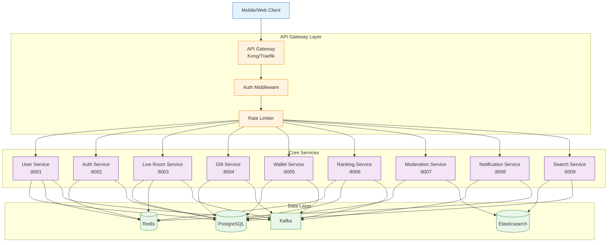
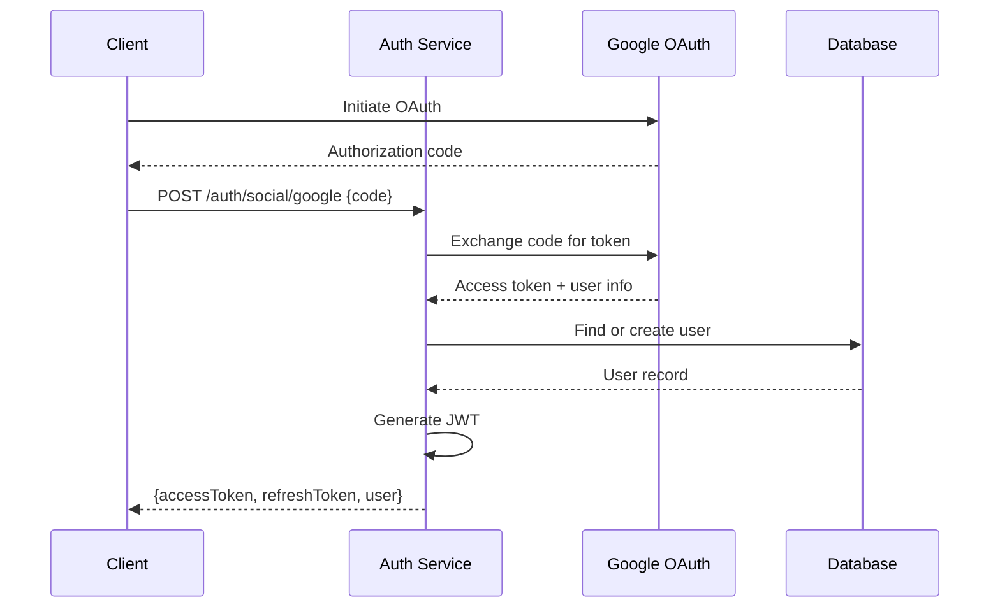

# Backend Services Architecture

## Overview

Backend services menggunakan **microservices architecture** dengan karakteristik:
- **Independent deployment**: Setiap service bisa di-deploy sendiri
- **Technology flexibility**: Service bisa pakai bahasa/framework berbeda
- **Scalability**: Scale service sesuai kebutuhan
- **Fault isolation**: Error di satu service tidak crash semua system

---

## Service Map



---

## 1. API Gateway

### Purpose
- Single entry point untuk semua API calls
- Authentication & authorization
- Rate limiting
- Request routing
- Load balancing
- API versioning
- Logging & monitoring

### Technology Options

**Option 1: Kong Gateway**
```yaml
# kong.yml
_format_version: "2.1"

services:
  - name: user-service
    url: http://user-service:8001
    routes:
      - name: user-routes
        paths:
          - /api/v1/users

  - name: live-service
    url: http://live-service:8003
    routes:
      - name: live-routes
        paths:
          - /api/v1/live

plugins:
  - name: rate-limiting
    config:
      minute: 100
      hour: 1000

  - name: jwt
    config:
      secret_is_base64: false
      key_claim_name: kid

  - name: prometheus
    config:
      per_consumer: true
```

**Option 2: Traefik**
```yaml
# traefik.yml
http:
  routers:
    user-service:
      rule: "PathPrefix(`/api/v1/users`)"
      service: user-service
      middlewares:
        - auth
        - ratelimit

    live-service:
      rule: "PathPrefix(`/api/v1/live`)"
      service: live-service
      middlewares:
        - auth
        - ratelimit

  services:
    user-service:
      loadBalancer:
        servers:
          - url: "http://user-service:8001"

    live-service:
      loadBalancer:
        servers:
          - url: "http://live-service:8003"

  middlewares:
    auth:
      forwardAuth:
        address: "http://auth-service:8002/verify"

    ratelimit:
      rateLimit:
        average: 100
        burst: 50
```

### Rate Limiting Strategy

```javascript
// Per-user rate limiting
const rateLimits = {
  anonymous: {
    per_minute: 20,
    per_hour: 100
  },
  authenticated: {
    per_minute: 100,
    per_hour: 5000
  },
  premium: {
    per_minute: 500,
    per_hour: 20000
  }
};

// Implementation (Redis-based)
async function checkRateLimit(userId, tier) {
  const key = `ratelimit:${userId}:${Math.floor(Date.now() / 60000)}`;
  const limit = rateLimits[tier].per_minute;

  const current = await redis.incr(key);
  await redis.expire(key, 60);

  if (current > limit) {
    throw new Error('Rate limit exceeded');
  }

  return { remaining: limit - current };
}
```

---

## 2. Auth Service

### Responsibilities
- User authentication
- JWT token generation & validation
- Social login (Google, Apple, Facebook)
- Session management
- Password reset
- Device tracking

### API Endpoints

```
POST   /auth/register
POST   /auth/login
POST   /auth/logout
POST   /auth/refresh
POST   /auth/reset-password
POST   /auth/verify-email
POST   /auth/social/google
POST   /auth/social/facebook
POST   /auth/social/apple
GET    /auth/verify
```

### JWT Structure

```json
{
  "header": {
    "alg": "RS256",
    "typ": "JWT",
    "kid": "key-id-123"
  },
  "payload": {
    "sub": "user_12345",
    "iat": 1674567890,
    "exp": 1674571490,
    "iss": "live-platform.com",
    "aud": "live-platform-api",
    "user_id": "12345",
    "username": "john_doe",
    "role": "user",
    "tier": "premium",
    "permissions": ["stream", "chat", "gift"]
  }
}
```

### Implementation (Node.js)

```javascript
const jwt = require('jsonwebtoken');
const bcrypt = require('bcrypt');
const { promisify } = require('util');
const redis = require('./redis');

class AuthService {
  async register({ email, password, username }) {
    // Validate input
    if (!email || !password || !username) {
      throw new Error('Missing required fields');
    }

    // Check if user exists
    const existingUser = await db.query(
      'SELECT id FROM users WHERE email = $1 OR username = $2',
      [email, username]
    );

    if (existingUser.rows.length > 0) {
      throw new Error('User already exists');
    }

    // Hash password
    const hashedPassword = await bcrypt.hash(password, 10);

    // Create user
    const result = await db.query(
      'INSERT INTO users (email, username, password_hash) VALUES ($1, $2, $3) RETURNING id',
      [email, username, hashedPassword]
    );

    const userId = result.rows[0].id;

    // Generate tokens
    const { accessToken, refreshToken } = this.generateTokens(userId);

    return { userId, accessToken, refreshToken };
  }

  async login({ email, password }) {
    // Find user
    const result = await db.query(
      'SELECT id, password_hash, username, role FROM users WHERE email = $1',
      [email]
    );

    if (result.rows.length === 0) {
      throw new Error('Invalid credentials');
    }

    const user = result.rows[0];

    // Verify password
    const isValid = await bcrypt.compare(password, user.password_hash);

    if (!isValid) {
      throw new Error('Invalid credentials');
    }

    // Generate tokens
    const { accessToken, refreshToken } = this.generateTokens(user.id);

    // Store session
    await redis.setex(
      `session:${user.id}`,
      86400 * 7, // 7 days
      JSON.stringify({ userId: user.id, username: user.username })
    );

    return { user, accessToken, refreshToken };
  }

  generateTokens(userId) {
    const accessToken = jwt.sign(
      {
        sub: userId,
        type: 'access'
      },
      process.env.JWT_SECRET,
      { expiresIn: '1h' }
    );

    const refreshToken = jwt.sign(
      {
        sub: userId,
        type: 'refresh'
      },
      process.env.JWT_REFRESH_SECRET,
      { expiresIn: '7d' }
    );

    return { accessToken, refreshToken };
  }

  async verifyToken(token) {
    try {
      const decoded = jwt.verify(token, process.env.JWT_SECRET);
      return decoded;
    } catch (error) {
      throw new Error('Invalid token');
    }
  }

  async refreshTokens(refreshToken) {
    const decoded = jwt.verify(refreshToken, process.env.JWT_REFRESH_SECRET);

    if (decoded.type !== 'refresh') {
      throw new Error('Invalid token type');
    }

    return this.generateTokens(decoded.sub);
  }
}

module.exports = new AuthService();
```

### Social Login Flow



---

## 3. User Service

### Responsibilities
- User profiles management
- Follow/unfollow system
- User search
- Online status
- User levels & badges
- User settings

### API Endpoints

```
GET    /users/:id
PUT    /users/:id
GET    /users/:id/profile
PUT    /users/:id/profile
POST   /users/:id/follow
DELETE /users/:id/unfollow
GET    /users/:id/followers
GET    /users/:id/following
GET    /users/search?q=keyword
GET    /users/:id/badges
POST   /users/:id/avatar
```

### Database Schema

```sql
CREATE TABLE users (
    id BIGSERIAL PRIMARY KEY,
    username VARCHAR(50) UNIQUE NOT NULL,
    email VARCHAR(255) UNIQUE NOT NULL,
    password_hash VARCHAR(255),
    role VARCHAR(20) DEFAULT 'user',
    status VARCHAR(20) DEFAULT 'active',
    created_at TIMESTAMP DEFAULT NOW(),
    updated_at TIMESTAMP DEFAULT NOW()
);

CREATE TABLE user_profiles (
    user_id BIGINT PRIMARY KEY REFERENCES users(id),
    display_name VARCHAR(100),
    bio TEXT,
    avatar_url VARCHAR(500),
    cover_url VARCHAR(500),
    gender VARCHAR(20),
    birthday DATE,
    country VARCHAR(50),
    level INT DEFAULT 1,
    experience_points INT DEFAULT 0,
    total_coins_sent BIGINT DEFAULT 0,
    total_coins_received BIGINT DEFAULT 0,
    total_streams INT DEFAULT 0,
    total_watch_time INT DEFAULT 0,
    created_at TIMESTAMP DEFAULT NOW(),
    updated_at TIMESTAMP DEFAULT NOW()
);

CREATE TABLE user_follows (
    follower_id BIGINT REFERENCES users(id),
    following_id BIGINT REFERENCES users(id),
    created_at TIMESTAMP DEFAULT NOW(),
    PRIMARY KEY (follower_id, following_id)
);

CREATE INDEX idx_follows_follower ON user_follows(follower_id);
CREATE INDEX idx_follows_following ON user_follows(following_id);

CREATE TABLE user_badges (
    id BIGSERIAL PRIMARY KEY,
    user_id BIGINT REFERENCES users(id),
    badge_type VARCHAR(50),
    badge_name VARCHAR(100),
    badge_icon_url VARCHAR(500),
    awarded_at TIMESTAMP DEFAULT NOW()
);
```

### Implementation

```go
// Go implementation
package user

import (
    "context"
    "database/sql"
    "time"
)

type User struct {
    ID        int64     `json:"id"`
    Username  string    `json:"username"`
    Email     string    `json:"email"`
    Role      string    `json:"role"`
    Status    string    `json:"status"`
    CreatedAt time.Time `json:"created_at"`
}

type UserProfile struct {
    UserID             int64   `json:"user_id"`
    DisplayName        string  `json:"display_name"`
    Bio                string  `json:"bio"`
    AvatarURL          string  `json:"avatar_url"`
    Level              int     `json:"level"`
    ExperiencePoints   int     `json:"experience_points"`
    FollowersCount     int     `json:"followers_count"`
    FollowingCount     int     `json:"following_count"`
}

type UserService struct {
    db    *sql.DB
    redis *redis.Client
    kafka *kafka.Producer
}

func (s *UserService) GetUser(ctx context.Context, userID int64) (*User, error) {
    // Try cache first
    cached, err := s.redis.Get(ctx, fmt.Sprintf("user:%d", userID)).Result()
    if err == nil {
        var user User
        json.Unmarshal([]byte(cached), &user)
        return &user, nil
    }

    // Query database
    var user User
    err = s.db.QueryRowContext(ctx,
        "SELECT id, username, email, role, status, created_at FROM users WHERE id = $1",
        userID,
    ).Scan(&user.ID, &user.Username, &user.Email, &user.Role, &user.Status, &user.CreatedAt)

    if err != nil {
        return nil, err
    }

    // Cache result
    cached, _ = json.Marshal(user)
    s.redis.Set(ctx, fmt.Sprintf("user:%d", userID), cached, time.Hour)

    return &user, nil
}

func (s *UserService) FollowUser(ctx context.Context, followerID, followingID int64) error {
    // Insert follow relationship
    _, err := s.db.ExecContext(ctx,
        "INSERT INTO user_follows (follower_id, following_id) VALUES ($1, $2) ON CONFLICT DO NOTHING",
        followerID, followingID,
    )

    if err != nil {
        return err
    }

    // Increment counters in Redis
    s.redis.Incr(ctx, fmt.Sprintf("user:%d:following_count", followerID))
    s.redis.Incr(ctx, fmt.Sprintf("user:%d:followers_count", followingID))

    // Publish event
    event := map[string]interface{}{
        "type":         "user.followed",
        "follower_id":  followerID,
        "following_id": followingID,
        "timestamp":    time.Now().Unix(),
    }

    s.kafka.Publish("user.events", event)

    return nil
}

func (s *UserService) GetFollowers(ctx context.Context, userID int64, limit, offset int) ([]User, error) {
    rows, err := s.db.QueryContext(ctx, `
        SELECT u.id, u.username, u.email, u.role, u.status, u.created_at
        FROM users u
        INNER JOIN user_follows uf ON u.id = uf.follower_id
        WHERE uf.following_id = $1
        ORDER BY uf.created_at DESC
        LIMIT $2 OFFSET $3
    `, userID, limit, offset)

    if err != nil {
        return nil, err
    }
    defer rows.Close()

    var followers []User
    for rows.Next() {
        var user User
        err := rows.Scan(&user.ID, &user.Username, &user.Email, &user.Role, &user.Status, &user.CreatedAt)
        if err != nil {
            continue
        }
        followers = append(followers, user)
    }

    return followers, nil
}
```

---

## 4. Live Room Service

### Responsibilities
- Create/end live sessions
- Room metadata management
- Viewer tracking
- Stream key generation
- Room recommendations
- Room search & discovery

### API Endpoints

```
POST   /live/start
POST   /live/end
GET    /live/:id
GET    /live/:id/join
POST   /live/:id/leave
GET    /live/active
GET    /live/recommended
GET    /live/category/:category
GET    /live/:id/viewers
```

### Database Schema

```sql
CREATE TABLE live_rooms (
    id BIGSERIAL PRIMARY KEY,
    host_id BIGINT REFERENCES users(id),
    title VARCHAR(200),
    description TEXT,
    category VARCHAR(50),
    tags VARCHAR(200)[],
    thumbnail_url VARCHAR(500),
    stream_key VARCHAR(100) UNIQUE NOT NULL,
    status VARCHAR(20) DEFAULT 'pending', -- pending, live, ended, banned
    started_at TIMESTAMP,
    ended_at TIMESTAMP,
    created_at TIMESTAMP DEFAULT NOW(),
    updated_at TIMESTAMP DEFAULT NOW()
);

CREATE TABLE live_sessions (
    id BIGSERIAL PRIMARY KEY,
    room_id BIGINT REFERENCES live_rooms(id),
    host_id BIGINT REFERENCES users(id),
    peak_viewers INT DEFAULT 0,
    total_viewers INT DEFAULT 0,
    total_gifts_received BIGINT DEFAULT 0,
    total_messages INT DEFAULT 0,
    duration_seconds INT DEFAULT 0,
    average_watch_time INT DEFAULT 0,
    quality_score DECIMAL(3, 2) DEFAULT 0,
    started_at TIMESTAMP,
    ended_at TIMESTAMP
);

CREATE TABLE live_viewers (
    room_id BIGINT REFERENCES live_rooms(id),
    user_id BIGINT REFERENCES users(id),
    joined_at TIMESTAMP DEFAULT NOW(),
    left_at TIMESTAMP,
    watch_time_seconds INT DEFAULT 0,
    PRIMARY KEY (room_id, user_id, joined_at)
);

CREATE INDEX idx_live_rooms_status ON live_rooms(status);
CREATE INDEX idx_live_rooms_host ON live_rooms(host_id);
CREATE INDEX idx_live_rooms_category ON live_rooms(category);
CREATE INDEX idx_live_sessions_room ON live_sessions(room_id);
CREATE INDEX idx_live_viewers_room ON live_viewers(room_id);
```

### Implementation

```javascript
class LiveRoomService {
  async startLive({ hostId, title, description, category, tags }) {
    // Check if host already has active room
    const activeRoom = await db.query(
      'SELECT id FROM live_rooms WHERE host_id = $1 AND status = $2',
      [hostId, 'live']
    );

    if (activeRoom.rows.length > 0) {
      throw new Error('Host already has an active live room');
    }

    // Generate unique stream key
    const streamKey = this.generateStreamKey();

    // Create room
    const result = await db.query(`
      INSERT INTO live_rooms (host_id, title, description, category, tags, stream_key, status, started_at)
      VALUES ($1, $2, $3, $4, $5, $6, $7, NOW())
      RETURNING id
    `, [hostId, title, description, category, tags, streamKey, 'live']);

    const roomId = result.rows[0].id;

    // Create session
    await db.query(`
      INSERT INTO live_sessions (room_id, host_id, started_at)
      VALUES ($1, $2, NOW())
    `, [roomId, hostId]);

    // Set room metadata in Redis
    await redis.hmset(`room:${roomId}`, {
      host_id: hostId,
      title,
      category,
      status: 'live',
      viewers: 0,
      started_at: Date.now()
    });

    // Add to active rooms set
    await redis.sadd('active_rooms', roomId);

    // Publish event
    await kafka.publish('room.events', {
      type: 'room.started',
      room_id: roomId,
      host_id: hostId,
      timestamp: Date.now()
    });

    // Notify followers
    this.notifyFollowers(hostId, roomId);

    return {
      room_id: roomId,
      stream_key: streamKey,
      ingest_url: `rtmp://ingest.yourdomain.com/live/${streamKey}`,
      playback_url: `https://cdn.yourdomain.com/hls/${roomId}/master.m3u8`
    };
  }

  async joinRoom({ roomId, userId }) {
    // Check if room is live
    const room = await redis.hgetall(`room:${roomId}`);

    if (!room || room.status !== 'live') {
      throw new Error('Room is not live');
    }

    // Increment viewer count
    const viewerCount = await redis.hincrby(`room:${roomId}`, 'viewers', 1);

    // Add user to viewers set
    await redis.sadd(`room:${roomId}:viewers`, userId);

    // Record join event
    await db.query(`
      INSERT INTO live_viewers (room_id, user_id, joined_at)
      VALUES ($1, $2, NOW())
    `, [roomId, userId]);

    // Update peak viewers
    await db.query(`
      UPDATE live_sessions
      SET peak_viewers = GREATEST(peak_viewers, $2),
          total_viewers = total_viewers + 1
      WHERE room_id = $1 AND ended_at IS NULL
    `, [roomId, viewerCount]);

    // Publish event
    await kafka.publish('room.events', {
      type: 'viewer.joined',
      room_id: roomId,
      user_id: userId,
      viewer_count: viewerCount,
      timestamp: Date.now()
    });

    // Get room details
    const roomDetails = await this.getRoomDetails(roomId);

    return {
      room: roomDetails,
      viewer_count: viewerCount,
      ws_token: this.generateWsToken(userId, roomId)
    };
  }

  async endLive({ roomId, hostId }) {
    // Verify host ownership
    const room = await db.query(
      'SELECT host_id, started_at FROM live_rooms WHERE id = $1',
      [roomId]
    );

    if (room.rows.length === 0 || room.rows[0].host_id !== hostId) {
      throw new Error('Unauthorized');
    }

    // Calculate duration
    const startedAt = room.rows[0].started_at;
    const durationSeconds = Math.floor((Date.now() - startedAt) / 1000);

    // Update room status
    await db.query(`
      UPDATE live_rooms
      SET status = 'ended', ended_at = NOW()
      WHERE id = $1
    `, [roomId]);

    // Update session
    await db.query(`
      UPDATE live_sessions
      SET ended_at = NOW(), duration_seconds = $2
      WHERE room_id = $1 AND ended_at IS NULL
    `, [roomId, durationSeconds]);

    // Remove from active rooms
    await redis.srem('active_rooms', roomId);
    await redis.del(`room:${roomId}`);

    // Publish event
    await kafka.publish('room.events', {
      type: 'room.ended',
      room_id: roomId,
      host_id: hostId,
      duration_seconds: durationSeconds,
      timestamp: Date.now()
    });

    return { success: true };
  }

  generateStreamKey() {
    const crypto = require('crypto');
    return crypto.randomBytes(16).toString('hex');
  }

  async getActiveRooms({ category, limit = 20, offset = 0 }) {
    // Get from Redis for fast response
    const roomIds = await redis.smembers('active_rooms');

    const rooms = [];
    for (const roomId of roomIds.slice(offset, offset + limit)) {
      const room = await redis.hgetall(`room:${roomId}`);
      if (!category || room.category === category) {
        rooms.push({
          room_id: roomId,
          ...room
        });
      }
    }

    // Sort by viewers
    rooms.sort((a, b) => b.viewers - a.viewers);

    return rooms;
  }
}
```

---

## 5. Gift Service

### Responsibilities
- Gift catalog management
- Gift transactions
- Gift combos & streaks
- Limited-time gifts
- Gift effects metadata

### API Endpoints

```
GET    /gifts
GET    /gifts/:id
POST   /gifts/send
GET    /gifts/history
GET    /gifts/top
GET    /gifts/combos
```

### Database Schema

```sql
CREATE TABLE gifts (
    id BIGSERIAL PRIMARY KEY,
    name VARCHAR(100) NOT NULL,
    description TEXT,
    price_coins INT NOT NULL,
    icon_url VARCHAR(500),
    animation_url VARCHAR(500),
    category VARCHAR(50),
    rarity VARCHAR(20), -- common, rare, epic, legendary
    is_limited BOOLEAN DEFAULT false,
    available_from TIMESTAMP,
    available_until TIMESTAMP,
    created_at TIMESTAMP DEFAULT NOW()
);

CREATE TABLE gift_logs (
    id BIGSERIAL PRIMARY KEY,
    room_id BIGINT REFERENCES live_rooms(id),
    sender_id BIGINT REFERENCES users(id),
    recipient_id BIGINT REFERENCES users(id),
    gift_id BIGINT REFERENCES gifts(id),
    quantity INT DEFAULT 1,
    total_coins INT NOT NULL,
    created_at TIMESTAMP DEFAULT NOW()
);

CREATE INDEX idx_gift_logs_room ON gift_logs(room_id, created_at);
CREATE INDEX idx_gift_logs_sender ON gift_logs(sender_id);
CREATE INDEX idx_gift_logs_recipient ON gift_logs(recipient_id);

CREATE TABLE gift_combos (
    id BIGSERIAL PRIMARY KEY,
    room_id BIGINT,
    sender_id BIGINT,
    gift_id BIGINT,
    combo_count INT DEFAULT 1,
    last_sent_at TIMESTAMP,
    expires_at TIMESTAMP
);
```

### Implementation

```python
from datetime import datetime, timedelta

class GiftService:
    def __init__(self, db, redis, kafka, wallet_service):
        self.db = db
        self.redis = redis
        self.kafka = kafka
        self.wallet_service = wallet_service

    async def send_gift(self, room_id, sender_id, recipient_id, gift_id, quantity=1):
        # Get gift details
        gift = await self.db.fetch_one(
            "SELECT id, price_coins, name, animation_url FROM gifts WHERE id = $1",
            gift_id
        )

        if not gift:
            raise ValueError("Gift not found")

        total_coins = gift['price_coins'] * quantity

        # Check balance
        balance = await self.wallet_service.get_balance(sender_id)
        if balance < total_coins:
            raise ValueError("Insufficient balance")

        # Start transaction
        async with self.db.transaction():
            # Deduct coins from sender
            await self.wallet_service.deduct(sender_id, total_coins, f"Gift: {gift['name']} x{quantity}")

            # Add coins to recipient (with platform fee)
            platform_fee = 0.10  # 10% platform fee
            recipient_coins = int(total_coins * (1 - platform_fee))
            await self.wallet_service.add(recipient_id, recipient_coins, f"Gift received: {gift['name']} x{quantity}")

            # Log gift transaction
            await self.db.execute("""
                INSERT INTO gift_logs (room_id, sender_id, recipient_id, gift_id, quantity, total_coins)
                VALUES ($1, $2, $3, $4, $5, $6)
            """, room_id, sender_id, recipient_id, gift_id, quantity, total_coins)

        # Update combo
        combo_count = await self.update_combo(room_id, sender_id, gift_id)

        # Publish event for real-time broadcast
        await self.kafka.publish('gift.events', {
            'type': 'gift.sent',
            'room_id': room_id,
            'sender_id': sender_id,
            'recipient_id': recipient_id,
            'gift': {
                'id': gift_id,
                'name': gift['name'],
                'animation_url': gift['animation_url'],
                'quantity': quantity,
                'combo_count': combo_count
            },
            'timestamp': int(datetime.now().timestamp())
        })

        # Update ranking
        await self.update_ranking(room_id, sender_id, total_coins)

        return {
            'success': True,
            'gift_id': gift_id,
            'quantity': quantity,
            'total_coins': total_coins,
            'combo_count': combo_count
        }

    async def update_combo(self, room_id, sender_id, gift_id):
        # Check for existing combo
        combo_key = f"combo:{room_id}:{sender_id}:{gift_id}"
        combo_data = await self.redis.hgetall(combo_key)

        if combo_data:
            # Increment combo
            combo_count = int(combo_data['count']) + 1
            await self.redis.hset(combo_key, 'count', combo_count)
            await self.redis.expire(combo_key, 30)  # 30 second window
        else:
            # Start new combo
            combo_count = 1
            await self.redis.hmset(combo_key, {
                'count': combo_count,
                'started_at': datetime.now().timestamp()
            })
            await self.redis.expire(combo_key, 30)

        return combo_count

    async def get_top_gifters(self, room_id, limit=10):
        # Get from Redis leaderboard
        top_gifters = await self.redis.zrevrange(
            f"room:{room_id}:top_gifters",
            0,
            limit - 1,
            withscores=True
        )

        result = []
        for user_id, total_coins in top_gifters:
            user = await self.get_user(user_id)
            result.append({
                'user': user,
                'total_coins': int(total_coins)
            })

        return result
```

---

## 6. Wallet Service

### Responsibilities
- Virtual currency balance
- Top-up processing
- Payment gateway integration
- Payout to hosts
- Transaction history
- Fraud detection

### API Endpoints

```
GET    /wallet/balance
POST   /wallet/topup
GET    /wallet/transactions
POST   /wallet/payout
GET    /wallet/payout-history
```

### Database Schema

```sql
CREATE TABLE wallets (
    user_id BIGINT PRIMARY KEY REFERENCES users(id),
    balance BIGINT DEFAULT 0,
    total_topped_up BIGINT DEFAULT 0,
    total_earned BIGINT DEFAULT 0,
    total_spent BIGINT DEFAULT 0,
    created_at TIMESTAMP DEFAULT NOW(),
    updated_at TIMESTAMP DEFAULT NOW()
);

CREATE TABLE wallet_transactions (
    id BIGSERIAL PRIMARY KEY,
    user_id BIGINT REFERENCES users(id),
    type VARCHAR(20), -- credit, debit
    amount BIGINT NOT NULL,
    balance_after BIGINT NOT NULL,
    category VARCHAR(50), -- topup, gift_sent, gift_received, payout, refund
    reference_id VARCHAR(100),
    description TEXT,
    metadata JSONB,
    created_at TIMESTAMP DEFAULT NOW()
);

CREATE INDEX idx_wallet_txn_user ON wallet_transactions(user_id, created_at DESC);
CREATE INDEX idx_wallet_txn_reference ON wallet_transactions(reference_id);

CREATE TABLE topup_orders (
    id BIGSERIAL PRIMARY KEY,
    user_id BIGINT REFERENCES users(id),
    amount_coins BIGINT NOT NULL,
    amount_usd DECIMAL(10, 2) NOT NULL,
    payment_method VARCHAR(50),
    payment_gateway VARCHAR(50),
    payment_gateway_order_id VARCHAR(200),
    status VARCHAR(20), -- pending, completed, failed, refunded
    completed_at TIMESTAMP,
    created_at TIMESTAMP DEFAULT NOW()
);

CREATE TABLE payout_requests (
    id BIGSERIAL PRIMARY KEY,
    user_id BIGINT REFERENCES users(id),
    amount_coins BIGINT NOT NULL,
    amount_usd DECIMAL(10, 2) NOT NULL,
    payout_method VARCHAR(50),
    payout_account VARCHAR(200),
    status VARCHAR(20), -- pending, approved, processing, completed, rejected
    processed_at TIMESTAMP,
    created_at TIMESTAMP DEFAULT NOW()
);
```

### Implementation

```go
type WalletService struct {
    db    *sql.DB
    redis *redis.Client
    kafka *kafka.Producer
    paymentGateway PaymentGateway
}

func (s *WalletService) GetBalance(ctx context.Context, userID int64) (int64, error) {
    // Try cache
    cached, err := s.redis.Get(ctx, fmt.Sprintf("wallet:%d:balance", userID)).Int64()
    if err == nil {
        return cached, nil
    }

    // Query database
    var balance int64
    err = s.db.QueryRowContext(ctx,
        "SELECT balance FROM wallets WHERE user_id = $1",
        userID,
    ).Scan(&balance)

    if err == sql.ErrNoRows {
        // Initialize wallet
        balance = 0
        _, err = s.db.ExecContext(ctx,
            "INSERT INTO wallets (user_id, balance) VALUES ($1, 0)",
            userID,
        )
    }

    // Cache result
    s.redis.Set(ctx, fmt.Sprintf("wallet:%d:balance", userID), balance, time.Hour)

    return balance, err
}

func (s *WalletService) Deduct(ctx context.Context, userID int64, amount int64, description string) error {
    tx, err := s.db.BeginTx(ctx, nil)
    if err != nil {
        return err
    }
    defer tx.Rollback()

    // Lock row for update
    var balance int64
    err = tx.QueryRowContext(ctx,
        "SELECT balance FROM wallets WHERE user_id = $1 FOR UPDATE",
        userID,
    ).Scan(&balance)

    if err != nil {
        return err
    }

    if balance < amount {
        return errors.New("insufficient balance")
    }

    // Update balance
    newBalance := balance - amount
    _, err = tx.ExecContext(ctx,
        "UPDATE wallets SET balance = $1, total_spent = total_spent + $2, updated_at = NOW() WHERE user_id = $3",
        newBalance, amount, userID,
    )

    if err != nil {
        return err
    }

    // Log transaction
    _, err = tx.ExecContext(ctx, `
        INSERT INTO wallet_transactions (user_id, type, amount, balance_after, category, description)
        VALUES ($1, $2, $3, $4, $5, $6)
    `, userID, "debit", amount, newBalance, "gift_sent", description)

    if err != nil {
        return err
    }

    err = tx.Commit()
    if err != nil {
        return err
    }

    // Update cache
    s.redis.Set(ctx, fmt.Sprintf("wallet:%d:balance", userID), newBalance, time.Hour)

    // Publish event
    s.kafka.Publish("wallet.events", map[string]interface{}{
        "type":      "balance.deducted",
        "user_id":   userID,
        "amount":    amount,
        "balance":   newBalance,
        "timestamp": time.Now().Unix(),
    })

    return nil
}

func (s *WalletService) TopUp(ctx context.Context, userID int64, amountCoins int64, amountUSD float64, paymentMethod string) (string, error) {
    // Create top-up order
    var orderID int64
    err := s.db.QueryRowContext(ctx, `
        INSERT INTO topup_orders (user_id, amount_coins, amount_usd, payment_method, payment_gateway, status)
        VALUES ($1, $2, $3, $4, $5, $6)
        RETURNING id
    `, userID, amountCoins, amountUSD, paymentMethod, "stripe", "pending").Scan(&orderID)

    if err != nil {
        return "", err
    }

    // Create payment via gateway
    paymentIntent, err := s.paymentGateway.CreatePayment(ctx, PaymentRequest{
        Amount:      amountUSD,
        Currency:    "USD",
        Description: fmt.Sprintf("Top-up %d coins", amountCoins),
        Metadata: map[string]string{
            "user_id":  fmt.Sprintf("%d", userID),
            "order_id": fmt.Sprintf("%d", orderID),
        },
    })

    if err != nil {
        return "", err
    }

    // Update order with payment gateway ID
    _, err = s.db.ExecContext(ctx,
        "UPDATE topup_orders SET payment_gateway_order_id = $1 WHERE id = $2",
        paymentIntent.ID, orderID,
    )

    return paymentIntent.ClientSecret, nil
}

func (s *WalletService) CompleteTopUp(ctx context.Context, orderID int64) error {
    // Get order details
    var userID, amountCoins int64
    err := s.db.QueryRowContext(ctx,
        "SELECT user_id, amount_coins FROM topup_orders WHERE id = $1",
        orderID,
    ).Scan(&userID, &amountCoins)

    if err != nil {
        return err
    }

    tx, err := s.db.BeginTx(ctx, nil)
    if err != nil {
        return err
    }
    defer tx.Rollback()

    // Update wallet
    var newBalance int64
    err = tx.QueryRowContext(ctx, `
        UPDATE wallets
        SET balance = balance + $1,
            total_topped_up = total_topped_up + $1,
            updated_at = NOW()
        WHERE user_id = $2
        RETURNING balance
    `, amountCoins, userID).Scan(&newBalance)

    if err != nil {
        return err
    }

    // Log transaction
    _, err = tx.ExecContext(ctx, `
        INSERT INTO wallet_transactions (user_id, type, amount, balance_after, category, reference_id, description)
        VALUES ($1, $2, $3, $4, $5, $6, $7)
    `, userID, "credit", amountCoins, newBalance, "topup", fmt.Sprintf("order_%d", orderID), "Top-up coins")

    if err != nil {
        return err
    }

    // Update order status
    _, err = tx.ExecContext(ctx,
        "UPDATE topup_orders SET status = 'completed', completed_at = NOW() WHERE id = $1",
        orderID,
    )

    if err != nil {
        return err
    }

    err = tx.Commit()
    if err != nil {
        return err
    }

    // Clear cache
    s.redis.Del(ctx, fmt.Sprintf("wallet:%d:balance", userID))

    return nil
}
```

---

## 7. Ranking Service

### Responsibilities
- Real-time leaderboards
- Daily/weekly/monthly rankings
- Achievement system
- Badge awarding
- Stats aggregation

### API Endpoints

```
GET    /rankings/top-hosts
GET    /rankings/top-gifters
GET    /rankings/top-streamers
GET    /rankings/user/:id
```

### Implementation (Redis-based)

```javascript
class RankingService {
  async updateGifterRanking(userId, roomId, coins) {
    const now = Date.now();
    const dayKey = this.getDayKey(now);
    const weekKey = this.getWeekKey(now);
    const monthKey = this.getMonthKey(now);

    // Update global rankings
    await Promise.all([
      redis.zincrby('ranking:gifters:daily:' + dayKey, coins, userId),
      redis.zincrby('ranking:gifters:weekly:' + weekKey, coins, userId),
      redis.zincrby('ranking:gifters:monthly:' + monthKey, coins, userId),
      redis.zincrby('ranking:gifters:alltime', coins, userId)
    ]);

    // Update room-specific rankings
    await redis.zincrby(`ranking:room:${roomId}:gifters`, coins, userId);

    // Set expiry
    await redis.expire('ranking:gifters:daily:' + dayKey, 86400 * 2);
    await redis.expire('ranking:gifters:weekly:' + weekKey, 86400 * 8);
    await redis.expire('ranking:gifters:monthly:' + monthKey, 86400 * 32);
  }

  async getTopGifters(period = 'daily', limit = 100) {
    const key = this.getRankingKey('gifters', period);

    const results = await redis.zrevrange(key, 0, limit - 1, 'WITHSCORES');

    const rankings = [];
    for (let i = 0; i < results.length; i += 2) {
      const userId = results[i];
      const coins = parseInt(results[i + 1]);

      const user = await this.getUserInfo(userId);

      rankings.push({
        rank: rankings.length + 1,
        user,
        total_coins: coins
      });
    }

    return rankings;
  }

  getRankingKey(type, period) {
    const now = Date.now();

    switch (period) {
      case 'daily':
        return `ranking:${type}:daily:${this.getDayKey(now)}`;
      case 'weekly':
        return `ranking:${type}:weekly:${this.getWeekKey(now)}`;
      case 'monthly':
        return `ranking:${type}:monthly:${this.getMonthKey(now)}`;
      case 'alltime':
        return `ranking:${type}:alltime`;
      default:
        throw new Error('Invalid period');
    }
  }

  getDayKey(timestamp) {
    const date = new Date(timestamp);
    return `${date.getFullYear()}-${String(date.getMonth() + 1).padStart(2, '0')}-${String(date.getDate()).padStart(2, '0')}`;
  }

  getWeekKey(timestamp) {
    const date = new Date(timestamp);
    const week = this.getWeekNumber(date);
    return `${date.getFullYear()}-W${String(week).padStart(2, '0')}`;
  }

  getMonthKey(timestamp) {
    const date = new Date(timestamp);
    return `${date.getFullYear()}-${String(date.getMonth() + 1).padStart(2, '0')}`;
  }
}
```

---

## Summary

Arsitektur backend services ini dirancang untuk:
- **Scalability**: Independent scaling per service
- **Reliability**: Service isolation, graceful degradation
- **Performance**: Redis caching, event-driven architecture
- **Maintainability**: Clear separation of concerns
- **Security**: JWT authentication, rate limiting, input validation

**Service Communication**:
- Synchronous: REST API via API Gateway
- Asynchronous: Kafka events for loose coupling
- Real-time: WebSocket for chat/signaling

**Next Steps**:
- Review [Database Schema Design](../database/schema-overview.md)
- Check [API Documentation](../api/)
- Explore [Deployment Architecture](../diagrams/05-deployment.md)
