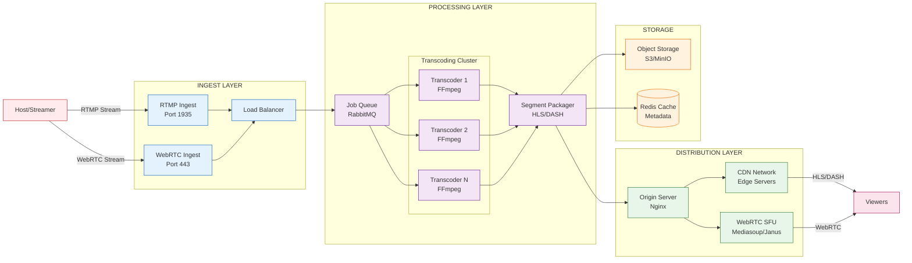
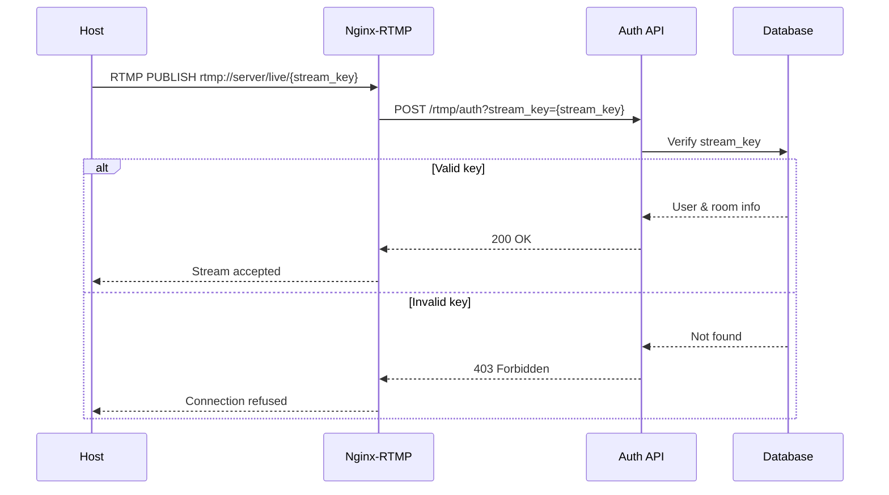
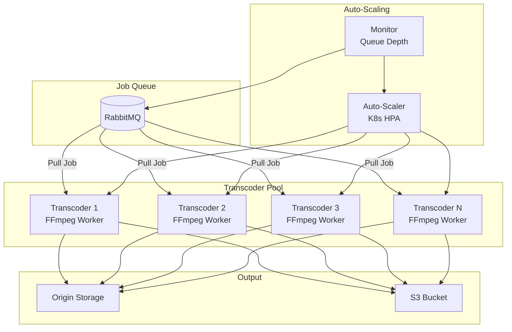
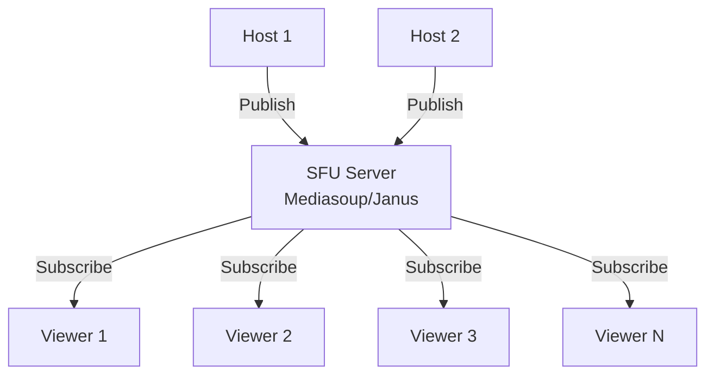

# Streaming Pipeline Architecture

## Overview

Streaming pipeline adalah komponen inti yang menangani:
1. **Ingest**: Menerima stream dari host
2. **Transcoding**: Konversi ke multi-bitrate
3. **Packaging**: Format HLS/DASH/WebRTC
4. **Distribution**: Delivery ke viewers via CDN
5. **Recording**: (Optional) Simpan session ke storage

---

## Pipeline Flow Diagram



---

## 1. Ingest Layer

### 1.1 RTMP Ingest

**Protocol**: RTMP (Real-Time Messaging Protocol)

**Port**: 1935

**URL Format**:
```
rtmp://ingest.yourdomain.com/live/{stream_key}
```

**Features**:
- Industry standard, didukung semua major streaming software
- Compatible dengan OBS Studio, XSplit, vMix
- Low CPU usage di client side
- Simple setup untuk host

**Server Options**:

**Option 1: Nginx with RTMP Module**
```nginx
rtmp {
    server {
        listen 1935;
        chunk_size 4096;

        application live {
            live on;
            record off;

            # Authentication
            on_publish http://api.yourdomain.com/rtmp/auth;

            # Forward to transcoder
            exec ffmpeg -i rtmp://localhost/live/$name
                -c:v libx264 -preset veryfast -tune zerolatency
                -c:a aac -b:a 128k
                -f flv rtmp://transcoder.internal/live/$name;

            # Recording (optional)
            record all;
            record_path /mnt/recordings;
            record_suffix -%Y-%m-%d-%H-%M-%S.flv;
        }
    }
}
```

**Option 2: SRS (Simple Realtime Server)**
```conf
listen              1935;
max_connections     10000;
daemon              on;

vhost __defaultVhost__ {
    http_hooks {
        enabled         on;
        on_publish      http://api.yourdomain.com/srs/auth;
        on_unpublish    http://api.yourdomain.com/srs/unpublish;
    }

    transcode {
        enabled     on;
        ffmpeg      /usr/local/bin/ffmpeg;

        engine source {
            enabled         on;
            vcodec          copy;
            acodec          copy;
            output          rtmp://127.0.0.1:[port]/live/[stream]_source;
        }
    }

    hls {
        enabled         on;
        hls_path        /tmp/hls;
        hls_fragment    2;
        hls_window      60;
    }
}
```

**Authentication Flow**:


### 1.2 WebRTC Ingest

**Protocol**: WebRTC (Web Real-Time Communication)

**Port**: 443 (HTTPS)

**Benefits**:
- Ultra-low latency (<1s glass-to-glass)
- Browser-native (no plugin needed)
- Adaptive bitrate built-in
- Better for multi-host scenarios (PK battles)

**Server Options**:

**Option 1: Janus Gateway**
```javascript
// Server config
{
    "general": {
        "api_secret": "your-secret",
        "session_timeout": 60
    },
    "plugins": {
        "janus.plugin.streaming": {
            "enabled": true,
            "mountpoints": []
        }
    }
}
```

**Option 2: Mediasoup (Node.js)**
```javascript
// Server setup
const mediasoup = require('mediasoup');

const worker = await mediasoup.createWorker({
    logLevel: 'warn',
    rtcMinPort: 10000,
    rtcMaxPort: 10100
});

const router = await worker.createRouter({
    mediaCodecs: [
        {
            kind: 'audio',
            mimeType: 'audio/opus',
            clockRate: 48000,
            channels: 2
        },
        {
            kind: 'video',
            mimeType: 'video/VP8',
            clockRate: 90000
        }
    ]
});
```

**Client Flow (Host)**:
```javascript
// 1. Get ICE servers from signaling server
const response = await fetch('/api/webrtc/ice-servers');
const { iceServers } = await response.json();

// 2. Create peer connection
const pc = new RTCPeerConnection({ iceServers });

// 3. Add local stream
const stream = await navigator.mediaDevices.getUserMedia({
    video: { width: 1280, height: 720, frameRate: 30 },
    audio: { echoCancellation: true, noiseSuppression: true }
});

stream.getTracks().forEach(track => pc.addTrack(track, stream));

// 4. Create offer
const offer = await pc.createOffer();
await pc.setLocalDescription(offer);

// 5. Send offer to server via signaling
await signalingSocket.emit('publish', {
    roomId: 'room123',
    sdp: offer.sdp
});

// 6. Receive answer from server
signalingSocket.on('answer', async (answer) => {
    await pc.setRemoteDescription(new RTCSessionDescription(answer));
});
```

### 1.3 Load Balancing & Geo-Routing

**GeoDNS Configuration**:
```
ingest.yourdomain.com
├─ Asia traffic     → ingest-sg.yourdomain.com (Singapore)
├─ US traffic       → ingest-us.yourdomain.com (Virginia)
└─ EU traffic       → ingest-eu.yourdomain.com (Frankfurt)
```

**Health Check**:
```bash
# Every 10 seconds
curl -f http://ingest-node:8080/health || remove_from_pool
```

---

## 2. Transcoding Layer

### 2.1 Why Transcoding?

**Problems Without Transcoding**:
- Host dengan internet lambat = semua viewer buffering
- Host kirim 1080p = viewer dengan 3G tidak bisa nonton
- Waste bandwidth & CDN cost

**Solution: Adaptive Bitrate Streaming (ABR)**
- Satu source stream → multiple qualities
- Player otomatis switch quality berdasarkan bandwidth
- Better user experience

### 2.2 Transcoding Profiles

**Profile Configuration**:
```yaml
profiles:
  - name: source
    resolution: original
    bitrate: original
    codec: copy

  - name: 1080p
    resolution: 1920x1080
    video_bitrate: 4000k
    audio_bitrate: 128k
    framerate: 30
    codec: h264
    preset: veryfast

  - name: 720p
    resolution: 1280x720
    video_bitrate: 2500k
    audio_bitrate: 128k
    framerate: 30
    codec: h264
    preset: veryfast

  - name: 480p
    resolution: 854x480
    video_bitrate: 1200k
    audio_bitrate: 96k
    framerate: 30
    codec: h264
    preset: veryfast

  - name: 360p
    resolution: 640x360
    video_bitrate: 800k
    audio_bitrate: 64k
    framerate: 30
    codec: h264
    preset: veryfast
```

### 2.3 FFmpeg Command

**Basic Transcoding**:
```bash
ffmpeg -i rtmp://source/live/stream_key \
  -c:a aac -ar 48000 -b:a 128k \
  -c:v libx264 -preset veryfast -tune zerolatency \
  -profile:v high -level 4.2 \
  -sc_threshold 0 -g 60 -keyint_min 60 \
  -map 0:v:0 -map 0:a:0 -s:v:0 1920x1080 -b:v:0 4000k \
  -map 0:v:0 -map 0:a:0 -s:v:1 1280x720 -b:v:1 2500k \
  -map 0:v:0 -map 0:a:0 -s:v:2 854x480 -b:v:2 1200k \
  -map 0:v:0 -map 0:a:0 -s:v:3 640x360 -b:v:3 800k \
  -f hls \
  -hls_time 2 \
  -hls_list_size 10 \
  -hls_flags delete_segments+append_list \
  -master_pl_name master.m3u8 \
  -var_stream_map "v:0,a:0 v:1,a:1 v:2,a:2 v:3,a:3" \
  /output/hls/stream_%v.m3u8
```

**GPU-Accelerated (NVIDIA)**:
```bash
ffmpeg -hwaccel cuda -hwaccel_output_format cuda \
  -i rtmp://source/live/stream_key \
  -c:v h264_nvenc -preset p4 -tune ll \
  -b:v 4000k -maxrate 4000k -bufsize 8000k \
  -c:a aac -b:a 128k \
  -f hls -hls_time 2 \
  /output/hls/stream.m3u8
```

### 2.4 Transcoding Cluster Architecture



**Worker Implementation (Python)**:
```python
import pika
import subprocess
import os

# Connect to RabbitMQ
connection = pika.BlockingConnection(
    pika.ConnectionParameters('rabbitmq.internal')
)
channel = connection.channel()
channel.queue_declare(queue='transcoding_jobs', durable=True)

def transcode_callback(ch, method, properties, body):
    job = json.loads(body)
    stream_key = job['stream_key']
    room_id = job['room_id']

    input_url = f"rtmp://ingest.internal/live/{stream_key}"
    output_path = f"/output/{room_id}"

    os.makedirs(output_path, exist_ok=True)

    ffmpeg_cmd = [
        'ffmpeg',
        '-i', input_url,
        # ... (transcoding parameters)
        '-f', 'hls',
        f"{output_path}/master.m3u8"
    ]

    process = subprocess.Popen(ffmpeg_cmd)

    # Wait for completion or stream end
    process.wait()

    # Upload to S3
    upload_to_s3(output_path, f"recordings/{room_id}")

    # ACK job
    ch.basic_ack(delivery_tag=method.delivery_tag)

# Consume jobs
channel.basic_qos(prefetch_count=1)
channel.basic_consume(
    queue='transcoding_jobs',
    on_message_callback=transcode_callback
)

print('Waiting for transcoding jobs...')
channel.start_consuming()
```

---

## 3. Packaging & Segmentation

### 3.1 HLS (HTTP Live Streaming)

**Format**: Apple's protocol, widely supported

**Structure**:
```
/hls/room123/
├── master.m3u8          # Master playlist
├── 1080p.m3u8           # 1080p variant playlist
├── 1080p_00001.ts       # Video segment 1
├── 1080p_00002.ts
├── 720p.m3u8
├── 720p_00001.ts
├── 480p.m3u8
├── 480p_00001.ts
└── ...
```

**Master Playlist (master.m3u8)**:
```m3u8
#EXTM3U
#EXT-X-VERSION:3

#EXT-X-STREAM-INF:BANDWIDTH=4000000,RESOLUTION=1920x1080,NAME="1080p"
1080p.m3u8

#EXT-X-STREAM-INF:BANDWIDTH=2500000,RESOLUTION=1280x720,NAME="720p"
720p.m3u8

#EXT-X-STREAM-INF:BANDWIDTH=1200000,RESOLUTION=854x480,NAME="480p"
480p.m3u8

#EXT-X-STREAM-INF:BANDWIDTH=800000,RESOLUTION=640x360,NAME="360p"
360p.m3u8
```

**Variant Playlist (1080p.m3u8)**:
```m3u8
#EXTM3U
#EXT-X-VERSION:3
#EXT-X-TARGETDURATION:2
#EXT-X-MEDIA-SEQUENCE:1

#EXTINF:2.000,
1080p_00001.ts
#EXTINF:2.000,
1080p_00002.ts
#EXTINF:2.000,
1080p_00003.ts
```

**Segment Duration**: 2-4 seconds
- Shorter = lower latency, higher request rate
- Longer = higher latency, better compression

### 3.2 DASH (Dynamic Adaptive Streaming over HTTP)

**Format**: Industry standard, MPEG

**Structure**:
```
/dash/room123/
├── manifest.mpd         # Manifest file
├── init_1080p.mp4       # Initialization segment
├── chunk_1080p_1.m4s    # Media chunk 1
├── chunk_1080p_2.m4s
├── init_720p.mp4
├── chunk_720p_1.m4s
└── ...
```

**Manifest (manifest.mpd)**:
```xml
<?xml version="1.0"?>
<MPD xmlns="urn:mpeg:dash:schema:mpd:2011">
  <Period>
    <AdaptationSet mimeType="video/mp4">
      <Representation id="1080p" bandwidth="4000000" width="1920" height="1080">
        <SegmentTemplate timescale="1000" initialization="init_1080p.mp4" media="chunk_1080p_$Number$.m4s" startNumber="1"/>
      </Representation>
      <Representation id="720p" bandwidth="2500000" width="1280" height="720">
        <SegmentTemplate timescale="1000" initialization="init_720p.mp4" media="chunk_720p_$Number$.m4s" startNumber="1"/>
      </Representation>
    </AdaptationSet>
  </Period>
</MPD>
```

### 3.3 Low-Latency HLS (LL-HLS)

**Features**:
- Latency: 2-3 seconds (vs 10-30s traditional HLS)
- Partial segment delivery
- Blocking playlist reload

**Configuration**:
```bash
ffmpeg -i rtmp://source \
  -f hls \
  -hls_time 2 \
  -hls_list_size 6 \
  -hls_flags delete_segments+program_date_time \
  -hls_playlist_type event \
  -hls_segment_type fmp4 \
  -var_stream_map "v:0,a:0" \
  master.m3u8
```

---

## 4. Distribution Layer

### 4.1 Origin Server

**Purpose**: Serve HLS/DASH playlists and segments

**Tech Stack**: Nginx or Caddy

**Nginx Configuration**:
```nginx
server {
    listen 80;
    server_name origin.yourdomain.com;

    root /var/www/streams;

    location /hls {
        types {
            application/vnd.apple.mpegurl m3u8;
            video/mp2t ts;
        }

        add_header Cache-Control "public, max-age=2";
        add_header Access-Control-Allow-Origin *;

        # Serve live segments
        try_files $uri =404;
    }

    location /dash {
        types {
            application/dash+xml mpd;
            video/mp4 mp4;
        }

        add_header Cache-Control "public, max-age=2";
        add_header Access-Control-Allow-Origin *;

        try_files $uri =404;
    }
}
```

### 4.2 CDN Integration

**CDN Providers**:
- **Cloudflare**: Global, affordable
- **AWS CloudFront**: AWS ecosystem
- **Akamai**: Enterprise-grade
- **Fastly**: Real-time, low latency

**CDN Configuration (CloudFlare)**:
```javascript
// Cache rules
{
  "cache_everything": true,
  "edge_cache_ttl": 2,
  "browser_cache_ttl": 0,
  "cache_by_device_type": false,
  "serve_stale_content": true
}
```

**URL Structure**:
```
https://cdn.yourdomain.com/hls/room123/master.m3u8
https://cdn.yourdomain.com/hls/room123/1080p.m3u8
https://cdn.yourdomain.com/hls/room123/1080p_00001.ts
```

**Signed URLs (Security)**:
```python
import hmac
import hashlib
import time

def generate_signed_url(base_url, secret_key, expiry=3600):
    expires_at = int(time.time()) + expiry

    message = f"{base_url}{expires_at}"
    signature = hmac.new(
        secret_key.encode(),
        message.encode(),
        hashlib.sha256
    ).hexdigest()

    return f"{base_url}?expires={expires_at}&signature={signature}"

# Usage
url = generate_signed_url(
    "https://cdn.yourdomain.com/hls/room123/master.m3u8",
    "your-secret-key",
    expiry=3600
)
# Output: https://cdn.yourdomain.com/hls/room123/master.m3u8?expires=1234567890&signature=abc123...
```

### 4.3 WebRTC SFU (Ultra Low Latency)

**When to Use**:
- Multi-host scenarios (PK battles)
- Interactive features (need <1s latency)
- Two-way communication

**Architecture**:


**SFU Benefits**:
- Lower server CPU (no transcoding)
- Lower latency (direct forwarding)
- Scalable (routing, not mixing)

**SFU Limitations**:
- Client must decode (more CPU on mobile)
- No adaptive bitrate (unless simulcast)
- Higher bandwidth from host

**Simulcast Support**:
```javascript
// Host sends 3 qualities
const sender = pc.addTrack(videoTrack);
const params = sender.getParameters();
params.encodings = [
    { rid: 'h', maxBitrate: 900000 },  // High
    { rid: 'm', maxBitrate: 300000, scaleResolutionDownBy: 2 },  // Medium
    { rid: 'l', maxBitrate: 100000, scaleResolutionDownBy: 4 }   // Low
];
await sender.setParameters(params);
```

---

## 5. Recording & VOD

### 5.1 Live Recording

**Use Cases**:
- Replay/highlights
- Compliance/evidence
- Content moderation review
- Monetization (paid replays)

**Recording Options**:

**Option 1: FFmpeg Recording**
```bash
ffmpeg -i rtmp://source/live/stream_key \
  -c copy \
  -f mp4 \
  -movflags +frag_keyframe+empty_moov \
  /recordings/room123_$(date +%s).mp4
```

**Option 2: HLS Segments to MP4**
```bash
# Concatenate HLS segments after live ends
ffmpeg -i /hls/room123/master.m3u8 \
  -c copy \
  -bsf:a aac_adtstoasc \
  /recordings/room123_full.mp4
```

**Storage Strategy**:
```
/recordings/
├── YYYY-MM-DD/
│   ├── room123_1234567890.mp4
│   ├── room456_1234567891.mp4
│   └── ...
```

**Upload to S3**:
```python
import boto3

s3 = boto3.client('s3')

def upload_recording(local_path, room_id, timestamp):
    s3_key = f"recordings/{room_id}/{timestamp}.mp4"

    s3.upload_file(
        local_path,
        'my-bucket',
        s3_key,
        ExtraArgs={
            'ContentType': 'video/mp4',
            'StorageClass': 'STANDARD_IA'  # Infrequent access
        }
    )

    # Clean up local file
    os.remove(local_path)

    return f"https://s3.amazonaws.com/my-bucket/{s3_key}"
```

### 5.2 VOD (Video On Demand)

**Flow**:
1. Recording uploaded to S3
2. Background job creates thumbnail
3. Optional: Transcode to multiple qualities
4. Generate playback URL
5. Update database with VOD metadata

**Thumbnail Generation**:
```bash
ffmpeg -i recording.mp4 \
  -ss 00:00:05 \
  -vframes 1 \
  -vf scale=640:360 \
  thumbnail.jpg
```

---

## 6. Monitoring & Metrics

### 6.1 Streaming Metrics

**Key Metrics**:
```python
metrics = {
    "stream_health": {
        "bitrate_kbps": 2500,
        "fps": 30,
        "resolution": "1280x720",
        "dropped_frames": 5,
        "keyframe_interval": 2
    },
    "viewer_qoe": {
        "buffering_ratio": 0.02,  # 2% of time spent buffering
        "avg_bitrate": 1800,
        "startup_time_ms": 1200,
        "rebuffer_count": 1
    },
    "infrastructure": {
        "cdn_cache_hit_rate": 0.95,
        "origin_bandwidth_mbps": 150,
        "transcoder_cpu_usage": 0.75,
        "active_transcoders": 8
    }
}
```

**Prometheus Metrics**:
```python
from prometheus_client import Counter, Gauge, Histogram

# Stream metrics
stream_bitrate = Gauge('stream_bitrate_kbps', 'Stream bitrate', ['room_id'])
stream_fps = Gauge('stream_fps', 'Stream FPS', ['room_id'])
stream_viewers = Gauge('stream_concurrent_viewers', 'Concurrent viewers', ['room_id'])

# CDN metrics
cdn_requests = Counter('cdn_requests_total', 'Total CDN requests', ['status'])
cdn_bandwidth = Counter('cdn_bandwidth_bytes', 'CDN bandwidth')

# Transcoding metrics
transcoding_duration = Histogram('transcoding_duration_seconds', 'Transcoding duration')
transcoding_queue_size = Gauge('transcoding_queue_size', 'Queue size')
```

### 6.2 Quality Monitoring

**Health Check**:
```python
def check_stream_health(room_id):
    # Check if segments are being updated
    last_segment_time = get_last_segment_time(room_id)

    if time.time() - last_segment_time > 10:
        alert("Stream frozen", room_id)

    # Check bitrate stability
    bitrate_variance = calculate_bitrate_variance(room_id)

    if bitrate_variance > 0.3:  # 30% variance
        alert("Unstable bitrate", room_id)
```

---

## 7. Cost Optimization

### 7.1 CDN Costs

**Strategies**:
- Use regional CDN for regional users
- Implement adaptive bitrate (lower quality = less bandwidth)
- Set aggressive caching (2s TTL)
- Use HTTP/2 for multiplexing

**Example Costs** (AWS CloudFront):
```
Region: Asia Pacific
Bandwidth: 10 TB/month
Cost: $1,200/month

Optimization:
- Reduce avg bitrate 2500kbps → 1800kbps: -28% = $864/month
- Regional CDN (Cloudflare): ~$300/month
```

### 7.2 Transcoding Costs

**Strategies**:
- Only transcode when viewers > threshold
- Use GPU instances (faster, more cost-effective)
- Use spot instances (70% cheaper)
- Smart scaling (scale down during low traffic)

**Example**:
```
CPU-based (c5.2xlarge): $0.34/hour
GPU-based (g4dn.xlarge): $0.526/hour (but 5x faster)

For 100 concurrent streams:
- CPU: 100 instances × $0.34 = $34/hour = $24,480/month
- GPU: 20 instances × $0.526 = $10.52/hour = $7,574/month

Savings: $16,906/month (69%)
```

---

## 8. Scalability Considerations

### 8.1 Horizontal Scaling

**Component Scaling**:
```yaml
Ingest Nodes:
  Min: 3 (1 per region)
  Max: 50
  Scale trigger: Active streams > 100 per node

Transcoders:
  Min: 5
  Max: 500
  Scale trigger: Queue depth > 10

Origin Servers:
  Min: 3
  Max: 20
  Scale trigger: Requests > 10K/s

SFU Nodes:
  Min: 2
  Max: 100
  Scale trigger: Connections > 500 per node
```

### 8.2 Performance Targets

```
Latency:
  HLS: 3-8 seconds
  LL-HLS: 2-3 seconds
  WebRTC: <1 second

Throughput:
  Ingest: 10K streams
  Transcoding: 10K concurrent jobs
  CDN: 1M+ concurrent viewers

Availability:
  Uptime: 99.9% (8.76 hours/year downtime)
  Mean time to recovery: <5 minutes
```

---

## Next Steps

1. **Review**: [Backend Services Architecture](./backend-services.md)
2. **Check**: [Database Schema](../database/schema-overview.md)
3. **Explore**: [API Specifications](../api/)
