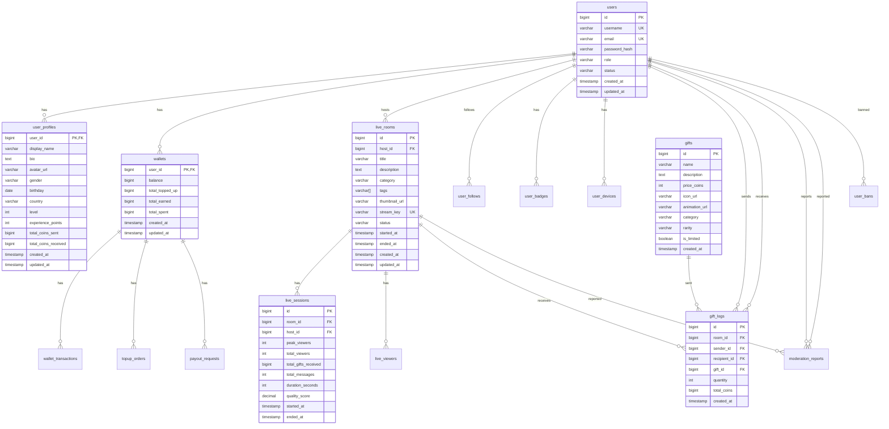

# Database Schema Overview

## Database Architecture

### Primary Database: PostgreSQL 14+

**Why PostgreSQL?**
- ACID compliance (critical for financial transactions)
- Rich data types (JSON, arrays, full-text search)
- Mature replication & high availability
- Strong performance for read-heavy workloads
- Excellent community & tooling

### Database Structure



---

## Core Tables

### 1. Users & Authentication

#### users
```sql
CREATE TABLE users (
    id BIGSERIAL PRIMARY KEY,
    username VARCHAR(50) UNIQUE NOT NULL,
    email VARCHAR(255) UNIQUE NOT NULL,
    password_hash VARCHAR(255),
    phone_number VARCHAR(20),
    role VARCHAR(20) DEFAULT 'user' CHECK (role IN ('user', 'host', 'moderator', 'admin')),
    status VARCHAR(20) DEFAULT 'active' CHECK (status IN ('active', 'suspended', 'banned', 'deleted')),
    email_verified BOOLEAN DEFAULT false,
    phone_verified BOOLEAN DEFAULT false,
    last_login_at TIMESTAMP,
    last_login_ip VARCHAR(45),
    created_at TIMESTAMP DEFAULT NOW(),
    updated_at TIMESTAMP DEFAULT NOW()
);

CREATE INDEX idx_users_email ON users(email);
CREATE INDEX idx_users_username ON users(username);
CREATE INDEX idx_users_status ON users(status);
CREATE INDEX idx_users_created ON users(created_at DESC);
```

#### user_profiles
```sql
CREATE TABLE user_profiles (
    user_id BIGINT PRIMARY KEY REFERENCES users(id) ON DELETE CASCADE,
    display_name VARCHAR(100),
    bio TEXT,
    avatar_url VARCHAR(500),
    cover_url VARCHAR(500),
    gender VARCHAR(20) CHECK (gender IN ('male', 'female', 'other', null)),
    birthday DATE,
    country VARCHAR(50),
    city VARCHAR(100),
    language VARCHAR(10) DEFAULT 'en',

    -- Gamification
    level INT DEFAULT 1,
    experience_points INT DEFAULT 0,

    -- Statistics
    total_coins_sent BIGINT DEFAULT 0,
    total_coins_received BIGINT DEFAULT 0,
    total_streams INT DEFAULT 0,
    total_watch_time INT DEFAULT 0, -- seconds
    total_followers INT DEFAULT 0,
    total_following INT DEFAULT 0,

    -- Settings
    is_private BOOLEAN DEFAULT false,
    allow_messages BOOLEAN DEFAULT true,
    show_online_status BOOLEAN DEFAULT true,

    created_at TIMESTAMP DEFAULT NOW(),
    updated_at TIMESTAMP DEFAULT NOW()
);

CREATE INDEX idx_profiles_country ON user_profiles(country);
CREATE INDEX idx_profiles_level ON user_profiles(level DESC);
```

#### user_follows
```sql
CREATE TABLE user_follows (
    follower_id BIGINT REFERENCES users(id) ON DELETE CASCADE,
    following_id BIGINT REFERENCES users(id) ON DELETE CASCADE,
    created_at TIMESTAMP DEFAULT NOW(),
    PRIMARY KEY (follower_id, following_id),
    CHECK (follower_id != following_id)
);

CREATE INDEX idx_follows_follower ON user_follows(follower_id);
CREATE INDEX idx_follows_following ON user_follows(following_id);
CREATE INDEX idx_follows_created ON user_follows(created_at DESC);
```

#### user_devices
```sql
CREATE TABLE user_devices (
    id BIGSERIAL PRIMARY KEY,
    user_id BIGINT REFERENCES users(id) ON DELETE CASCADE,
    device_id VARCHAR(255) UNIQUE NOT NULL,
    device_type VARCHAR(20) CHECK (device_type IN ('ios', 'android', 'web')),
    device_name VARCHAR(100),
    fcm_token VARCHAR(500), -- Firebase Cloud Messaging
    apns_token VARCHAR(500), -- Apple Push Notification
    is_active BOOLEAN DEFAULT true,
    last_active_at TIMESTAMP DEFAULT NOW(),
    created_at TIMESTAMP DEFAULT NOW()
);

CREATE INDEX idx_devices_user ON user_devices(user_id);
CREATE INDEX idx_devices_device_id ON user_devices(device_id);
CREATE INDEX idx_devices_active ON user_devices(is_active, user_id);
```

#### user_badges
```sql
CREATE TABLE user_badges (
    id BIGSERIAL PRIMARY KEY,
    user_id BIGINT REFERENCES users(id) ON DELETE CASCADE,
    badge_type VARCHAR(50) NOT NULL,
    badge_name VARCHAR(100) NOT NULL,
    badge_icon_url VARCHAR(500),
    badge_description TEXT,
    awarded_at TIMESTAMP DEFAULT NOW()
);

CREATE INDEX idx_badges_user ON user_badges(user_id);
CREATE INDEX idx_badges_type ON user_badges(badge_type);
```

---

### 2. Live Streaming

#### live_rooms
```sql
CREATE TABLE live_rooms (
    id BIGSERIAL PRIMARY KEY,
    host_id BIGINT REFERENCES users(id) ON DELETE CASCADE,

    -- Metadata
    title VARCHAR(200) NOT NULL,
    description TEXT,
    category VARCHAR(50),
    tags VARCHAR(200)[] DEFAULT '{}',
    thumbnail_url VARCHAR(500),
    language VARCHAR(10) DEFAULT 'en',

    -- Streaming
    stream_key VARCHAR(100) UNIQUE NOT NULL,
    ingest_url VARCHAR(500),
    playback_url VARCHAR(500),

    -- Status
    status VARCHAR(20) DEFAULT 'pending' CHECK (status IN ('pending', 'live', 'ended', 'banned')),
    current_viewers INT DEFAULT 0,

    -- Timestamps
    started_at TIMESTAMP,
    ended_at TIMESTAMP,
    created_at TIMESTAMP DEFAULT NOW(),
    updated_at TIMESTAMP DEFAULT NOW()
);

CREATE INDEX idx_rooms_host ON live_rooms(host_id);
CREATE INDEX idx_rooms_status ON live_rooms(status);
CREATE INDEX idx_rooms_category ON live_rooms(category, status);
CREATE INDEX idx_rooms_started ON live_rooms(started_at DESC);
CREATE INDEX idx_rooms_viewers ON live_rooms(current_viewers DESC);
```

#### live_sessions
```sql
CREATE TABLE live_sessions (
    id BIGSERIAL PRIMARY KEY,
    room_id BIGINT REFERENCES live_rooms(id) ON DELETE CASCADE,
    host_id BIGINT REFERENCES users(id) ON DELETE CASCADE,

    -- Metrics
    peak_viewers INT DEFAULT 0,
    total_viewers INT DEFAULT 0, -- unique viewers
    total_views INT DEFAULT 0, -- total join count (can rejoin)
    total_gifts_received BIGINT DEFAULT 0,
    total_messages INT DEFAULT 0,
    duration_seconds INT DEFAULT 0,
    average_watch_time INT DEFAULT 0, -- seconds per viewer

    -- Quality
    quality_score DECIMAL(3, 2) DEFAULT 0, -- 0.00 to 5.00
    average_bitrate INT, -- kbps
    average_fps INT,
    dropped_frames INT DEFAULT 0,

    -- Recording
    recording_url VARCHAR(500),
    recording_duration INT, -- seconds
    recording_size BIGINT, -- bytes

    -- Timestamps
    started_at TIMESTAMP,
    ended_at TIMESTAMP
);

CREATE INDEX idx_sessions_room ON live_sessions(room_id);
CREATE INDEX idx_sessions_host ON live_sessions(host_id);
CREATE INDEX idx_sessions_started ON live_sessions(started_at DESC);
CREATE INDEX idx_sessions_peak_viewers ON live_sessions(peak_viewers DESC);
```

#### live_viewers
```sql
CREATE TABLE live_viewers (
    id BIGSERIAL PRIMARY KEY,
    room_id BIGINT REFERENCES live_rooms(id) ON DELETE CASCADE,
    user_id BIGINT REFERENCES users(id) ON DELETE CASCADE,

    -- Tracking
    joined_at TIMESTAMP DEFAULT NOW(),
    left_at TIMESTAMP,
    watch_time_seconds INT DEFAULT 0,
    is_active BOOLEAN DEFAULT true,

    -- Engagement
    messages_sent INT DEFAULT 0,
    gifts_sent INT DEFAULT 0,
    total_coins_spent BIGINT DEFAULT 0
);

CREATE INDEX idx_viewers_room ON live_viewers(room_id, is_active);
CREATE INDEX idx_viewers_user ON live_viewers(user_id);
CREATE INDEX idx_viewers_joined ON live_viewers(joined_at DESC);
CREATE UNIQUE INDEX idx_viewers_active ON live_viewers(room_id, user_id) WHERE is_active = true;
```

---

### 3. Wallet & Gifts

#### wallets
```sql
CREATE TABLE wallets (
    user_id BIGINT PRIMARY KEY REFERENCES users(id) ON DELETE CASCADE,

    -- Balance
    balance BIGINT DEFAULT 0 CHECK (balance >= 0),

    -- Lifetime stats
    total_topped_up BIGINT DEFAULT 0,
    total_earned BIGINT DEFAULT 0,
    total_spent BIGINT DEFAULT 0,
    total_withdrawn BIGINT DEFAULT 0,

    -- Metadata
    currency VARCHAR(3) DEFAULT 'USD',
    created_at TIMESTAMP DEFAULT NOW(),
    updated_at TIMESTAMP DEFAULT NOW()
);

CREATE INDEX idx_wallets_balance ON wallets(balance DESC);
```

#### wallet_transactions
```sql
CREATE TABLE wallet_transactions (
    id BIGSERIAL PRIMARY KEY,
    user_id BIGINT REFERENCES users(id) ON DELETE CASCADE,

    -- Transaction details
    type VARCHAR(20) CHECK (type IN ('credit', 'debit')),
    amount BIGINT NOT NULL CHECK (amount > 0),
    balance_before BIGINT NOT NULL,
    balance_after BIGINT NOT NULL,

    -- Categorization
    category VARCHAR(50) CHECK (category IN (
        'topup', 'gift_sent', 'gift_received', 'payout',
        'refund', 'bonus', 'penalty', 'admin_adjustment'
    )),
    reference_id VARCHAR(100), -- External reference (order ID, gift log ID, etc)
    reference_type VARCHAR(50),
    description TEXT,

    -- Metadata
    metadata JSONB,
    ip_address VARCHAR(45),

    created_at TIMESTAMP DEFAULT NOW()
);

CREATE INDEX idx_txn_user ON wallet_transactions(user_id, created_at DESC);
CREATE INDEX idx_txn_reference ON wallet_transactions(reference_type, reference_id);
CREATE INDEX idx_txn_category ON wallet_transactions(category, created_at DESC);
CREATE INDEX idx_txn_created ON wallet_transactions(created_at DESC);
```

#### topup_orders
```sql
CREATE TABLE topup_orders (
    id BIGSERIAL PRIMARY KEY,
    user_id BIGINT REFERENCES users(id) ON DELETE CASCADE,

    -- Order details
    amount_coins BIGINT NOT NULL,
    amount_usd DECIMAL(10, 2) NOT NULL,
    bonus_coins BIGINT DEFAULT 0,

    -- Payment
    payment_method VARCHAR(50), -- card, paypal, applepay, googlepay
    payment_gateway VARCHAR(50), -- stripe, paypal, etc
    payment_gateway_order_id VARCHAR(200),
    payment_gateway_transaction_id VARCHAR(200),

    -- Status
    status VARCHAR(20) DEFAULT 'pending' CHECK (status IN (
        'pending', 'processing', 'completed', 'failed', 'refunded'
    )),

    -- Metadata
    failure_reason TEXT,
    ip_address VARCHAR(45),
    user_agent TEXT,

    -- Timestamps
    completed_at TIMESTAMP,
    created_at TIMESTAMP DEFAULT NOW()
);

CREATE INDEX idx_topup_user ON topup_orders(user_id, created_at DESC);
CREATE INDEX idx_topup_status ON topup_orders(status, created_at DESC);
CREATE INDEX idx_topup_gateway_order ON topup_orders(payment_gateway_order_id);
```

#### payout_requests
```sql
CREATE TABLE payout_requests (
    id BIGSERIAL PRIMARY KEY,
    user_id BIGINT REFERENCES users(id) ON DELETE CASCADE,

    -- Payout details
    amount_coins BIGINT NOT NULL,
    amount_usd DECIMAL(10, 2) NOT NULL,
    platform_fee DECIMAL(10, 2) DEFAULT 0,
    final_amount_usd DECIMAL(10, 2) NOT NULL,

    -- Payout method
    payout_method VARCHAR(50), -- bank_transfer, paypal, etc
    payout_account VARCHAR(200),
    payout_account_name VARCHAR(200),

    -- Status
    status VARCHAR(20) DEFAULT 'pending' CHECK (status IN (
        'pending', 'approved', 'processing', 'completed', 'rejected', 'cancelled'
    )),
    rejection_reason TEXT,

    -- Metadata
    admin_notes TEXT,
    processed_by BIGINT REFERENCES users(id),

    -- Timestamps
    processed_at TIMESTAMP,
    created_at TIMESTAMP DEFAULT NOW()
);

CREATE INDEX idx_payout_user ON payout_requests(user_id, created_at DESC);
CREATE INDEX idx_payout_status ON payout_requests(status, created_at DESC);
```

#### gifts
```sql
CREATE TABLE gifts (
    id BIGSERIAL PRIMARY KEY,

    -- Basic info
    name VARCHAR(100) NOT NULL,
    description TEXT,
    price_coins INT NOT NULL CHECK (price_coins > 0),

    -- Media
    icon_url VARCHAR(500),
    animation_url VARCHAR(500),
    animation_type VARCHAR(20), -- lottie, gif, svga

    -- Categorization
    category VARCHAR(50),
    rarity VARCHAR(20) CHECK (rarity IN ('common', 'rare', 'epic', 'legendary')),
    sort_order INT DEFAULT 0,

    -- Availability
    is_active BOOLEAN DEFAULT true,
    is_limited BOOLEAN DEFAULT false,
    available_from TIMESTAMP,
    available_until TIMESTAMP,
    max_purchases INT, -- per user
    total_stock INT, -- global limit
    remaining_stock INT,

    -- Metadata
    metadata JSONB,

    created_at TIMESTAMP DEFAULT NOW(),
    updated_at TIMESTAMP DEFAULT NOW()
);

CREATE INDEX idx_gifts_category ON gifts(category, is_active);
CREATE INDEX idx_gifts_price ON gifts(price_coins);
CREATE INDEX idx_gifts_active ON gifts(is_active, sort_order);
```

#### gift_logs
```sql
CREATE TABLE gift_logs (
    id BIGSERIAL PRIMARY KEY,
    room_id BIGINT REFERENCES live_rooms(id) ON DELETE CASCADE,
    sender_id BIGINT REFERENCES users(id) ON DELETE CASCADE,
    recipient_id BIGINT REFERENCES users(id) ON DELETE CASCADE,
    gift_id BIGINT REFERENCES gifts(id),

    -- Transaction
    quantity INT DEFAULT 1 CHECK (quantity > 0),
    price_per_unit INT NOT NULL,
    total_coins BIGINT NOT NULL,

    -- Metadata
    is_combo BOOLEAN DEFAULT false,
    combo_count INT DEFAULT 1,
    metadata JSONB,

    created_at TIMESTAMP DEFAULT NOW()
);

CREATE INDEX idx_giftlogs_room ON gift_logs(room_id, created_at DESC);
CREATE INDEX idx_giftlogs_sender ON gift_logs(sender_id, created_at DESC);
CREATE INDEX idx_giftlogs_recipient ON gift_logs(recipient_id, created_at DESC);
CREATE INDEX idx_giftlogs_gift ON gift_logs(gift_id, created_at DESC);
CREATE INDEX idx_giftlogs_created ON gift_logs(created_at DESC);
```

---

### 4. Moderation & Safety

#### moderation_reports
```sql
CREATE TABLE moderation_reports (
    id BIGSERIAL PRIMARY KEY,

    -- Reporter
    reporter_id BIGINT REFERENCES users(id) ON DELETE SET NULL,

    -- Target
    target_type VARCHAR(20) CHECK (target_type IN ('user', 'room', 'message')),
    target_id BIGINT NOT NULL,
    target_user_id BIGINT REFERENCES users(id) ON DELETE SET NULL,

    -- Report details
    reason VARCHAR(50) CHECK (reason IN (
        'spam', 'harassment', 'nudity', 'violence',
        'hate_speech', 'impersonation', 'copyright', 'other'
    )),
    description TEXT,

    -- Status
    status VARCHAR(20) DEFAULT 'pending' CHECK (status IN (
        'pending', 'reviewing', 'resolved', 'dismissed'
    )),
    resolution VARCHAR(50), -- warning, ban, content_removed, no_action
    admin_notes TEXT,

    -- Handled by
    handled_by BIGINT REFERENCES users(id),
    handled_at TIMESTAMP,

    created_at TIMESTAMP DEFAULT NOW()
);

CREATE INDEX idx_reports_reporter ON moderation_reports(reporter_id);
CREATE INDEX idx_reports_target ON moderation_reports(target_type, target_id);
CREATE INDEX idx_reports_status ON moderation_reports(status, created_at DESC);
CREATE INDEX idx_reports_created ON moderation_reports(created_at DESC);
```

#### user_bans
```sql
CREATE TABLE user_bans (
    id BIGSERIAL PRIMARY KEY,
    user_id BIGINT REFERENCES users(id) ON DELETE CASCADE,

    -- Ban details
    ban_type VARCHAR(20) CHECK (ban_type IN ('temporary', 'permanent')),
    reason VARCHAR(50),
    description TEXT,

    -- Duration
    banned_at TIMESTAMP DEFAULT NOW(),
    banned_until TIMESTAMP, -- NULL for permanent
    is_active BOOLEAN DEFAULT true,

    -- Admin
    banned_by BIGINT REFERENCES users(id),
    admin_notes TEXT,

    -- Unban
    unbanned_at TIMESTAMP,
    unbanned_by BIGINT REFERENCES users(id),
    unban_reason TEXT
);

CREATE INDEX idx_bans_user ON user_bans(user_id, is_active);
CREATE INDEX idx_bans_active ON user_bans(is_active, banned_until);
```

#### blocked_words
```sql
CREATE TABLE blocked_words (
    id BIGSERIAL PRIMARY KEY,
    word VARCHAR(100) UNIQUE NOT NULL,
    is_regex BOOLEAN DEFAULT false,
    severity VARCHAR(20) CHECK (severity IN ('low', 'medium', 'high')),
    action VARCHAR(20) CHECK (action IN ('filter', 'warn', 'mute')),
    is_active BOOLEAN DEFAULT true,
    created_at TIMESTAMP DEFAULT NOW()
);

CREATE INDEX idx_blocked_words_active ON blocked_words(is_active);
```

---

## Redis Schema

### Key Patterns

```
# Sessions
session:{user_id} → JSON (user session data)

# Wallet balance cache
wallet:{user_id}:balance → INTEGER

# Room data
room:{room_id} → HASH {host_id, title, category, status, viewers, started_at}
room:{room_id}:viewers → SET {user_id1, user_id2, ...}
room:{room_id}:messages → LIST [message1, message2, ...]

# Active rooms
active_rooms → SET {room_id1, room_id2, ...}
category:{category}:active_rooms → SET {room_id1, room_id2, ...}

# Rankings
ranking:gifters:daily:{YYYY-MM-DD} → SORTED SET {user_id: score}
ranking:gifters:weekly:{YYYY-Www} → SORTED SET {user_id: score}
ranking:gifters:monthly:{YYYY-MM} → SORTED SET {user_id: score}
ranking:gifters:alltime → SORTED SET {user_id: score}
ranking:hosts:daily:{YYYY-MM-DD} → SORTED SET {user_id: score}
ranking:room:{room_id}:gifters → SORTED SET {user_id: score}

# Online users
online_users → SET {user_id1, user_id2, ...}
user:{user_id}:online_status → STRING {online|offline}

# Gift combos
combo:{room_id}:{sender_id}:{gift_id} → HASH {count, started_at}

# Rate limiting
ratelimit:{user_id}:{minute} → INTEGER (expires in 60s)
ratelimit:{ip}:{minute} → INTEGER (expires in 60s)

# Following/Followers cache
user:{user_id}:followers → SET {user_id1, user_id2, ...}
user:{user_id}:following → SET {user_id1, user_id2, ...}

# Stream keys
streamkey:{stream_key} → JSON {room_id, host_id, created_at}
```

---

## Database Optimization

### Partitioning Strategy

```sql
-- Partition gift_logs by month for better query performance
CREATE TABLE gift_logs_2026_01 PARTITION OF gift_logs
FOR VALUES FROM ('2026-01-01') TO ('2026-02-01');

CREATE TABLE gift_logs_2026_02 PARTITION OF gift_logs
FOR VALUES FROM ('2026-02-01') TO ('2026-03-01');

-- Partition wallet_transactions by month
CREATE TABLE wallet_transactions_2026_01 PARTITION OF wallet_transactions
FOR VALUES FROM ('2026-01-01') TO ('2026-02-01');
```

### Materialized Views

```sql
-- Top hosts by revenue (refresh hourly)
CREATE MATERIALIZED VIEW mv_top_hosts AS
SELECT
    u.id,
    u.username,
    up.avatar_url,
    SUM(gl.total_coins) as total_revenue,
    COUNT(DISTINCT lr.id) as total_streams,
    MAX(ls.peak_viewers) as max_viewers
FROM users u
JOIN user_profiles up ON u.id = up.user_id
LEFT JOIN live_rooms lr ON u.id = lr.host_id
LEFT JOIN live_sessions ls ON lr.id = ls.room_id
LEFT JOIN gift_logs gl ON u.id = gl.recipient_id
WHERE lr.created_at > NOW() - INTERVAL '30 days'
GROUP BY u.id, u.username, up.avatar_url
ORDER BY total_revenue DESC
LIMIT 100;

CREATE UNIQUE INDEX idx_mv_top_hosts ON mv_top_hosts(id);
```

### Connection Pooling

```javascript
// PgBouncer configuration
[databases]
liveplatform = host=127.0.0.1 port=5432 dbname=liveplatform

[pgbouncer]
pool_mode = transaction
max_client_conn = 10000
default_pool_size = 25
min_pool_size = 5
reserve_pool_size = 10
reserve_pool_timeout = 5
```

---

## Backup & Recovery

### Backup Strategy

```bash
# Full backup daily
pg_dump -Fc liveplatform > /backups/liveplatform_$(date +%Y%m%d).dump

# Continuous archiving (WAL)
archive_mode = on
archive_command = 'cp %p /archive/%f'
wal_level = replica

# Point-in-time recovery enabled
```

### Replication

```
Primary (Write)
  ├─ Replica 1 (Read) - Same region
  ├─ Replica 2 (Read) - Same region
  └─ Replica 3 (Read) - Different region (DR)
```

---

## Next Steps

1. **Review**: [API Specifications](../api/)
2. **Explore**: [Deployment Architecture](../diagrams/05-deployment.md)
3. **Check**: [Streaming Pipeline](../components/streaming-pipeline.md)
