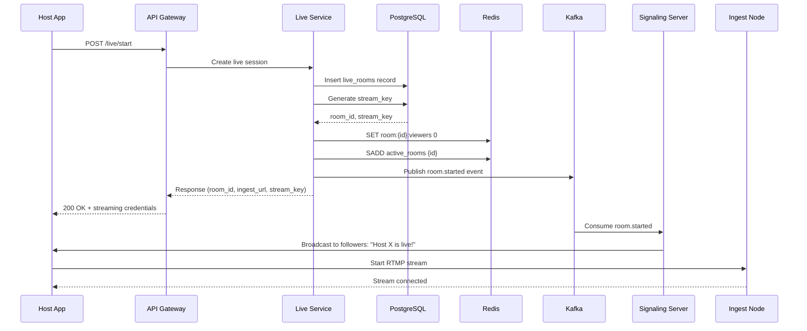
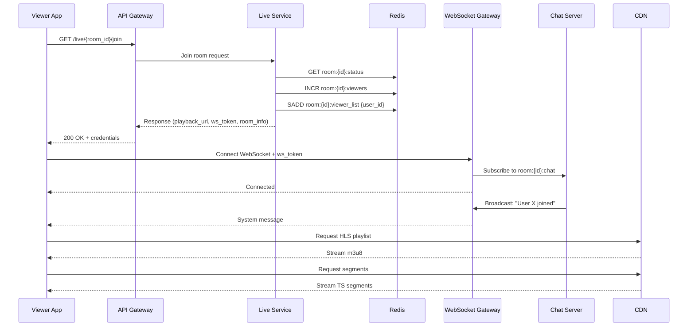
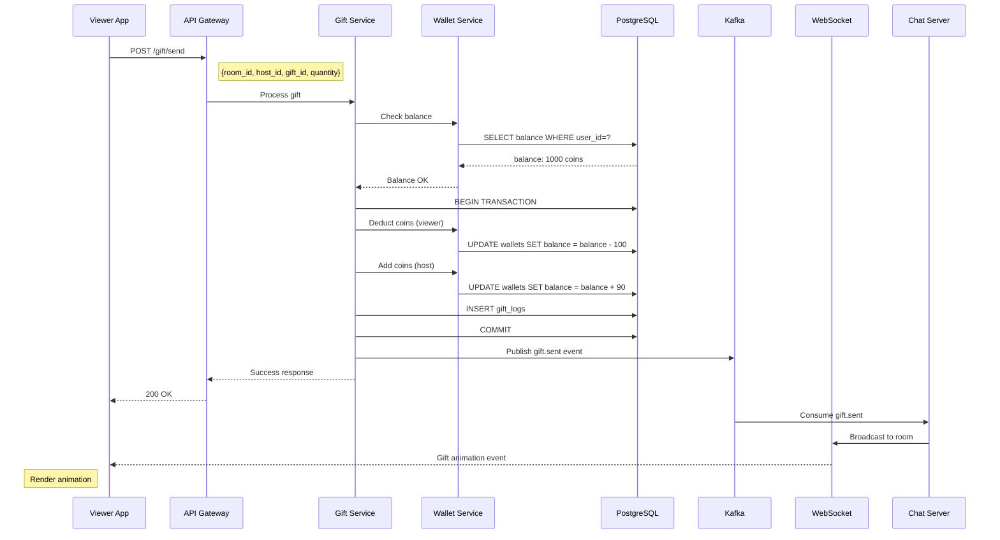
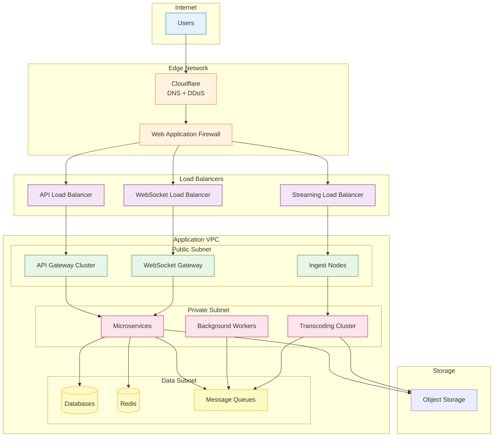
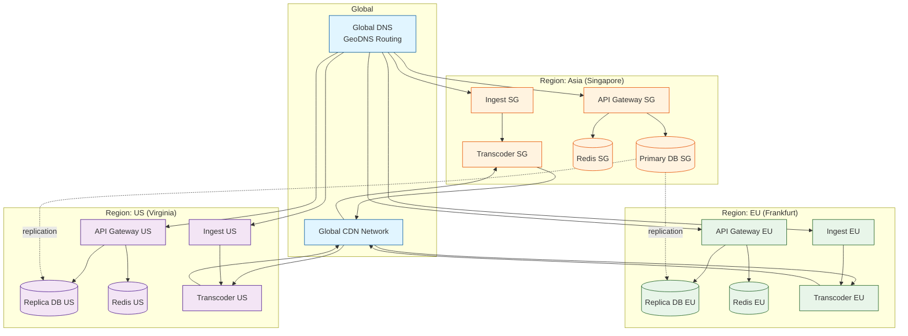
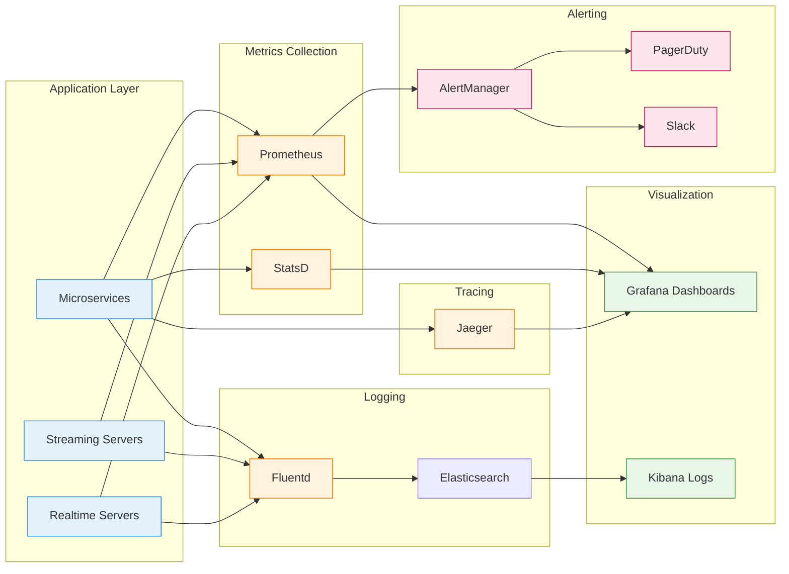

# High-Level Architecture Diagram

## System Overview

Diagram ini menunjukkan arsitektur lengkap platform live streaming dari perspektif 4 layer utama.

```mermaid
graph TB
    subgraph "CLIENT LAYER"
        iOS[iOS App]
        Android[Android App]
        Web[Web App]
    end

    subgraph "EDGE & REALTIME LAYER"
        subgraph "Streaming Infrastructure"
            Ingest[RTMP/WebRTC Ingest Nodes]
            Transcoder[Transcoding Cluster]
            CDN[CDN Network<br/>HLS/DASH]
            SFU[WebRTC SFU Nodes]
        end

        subgraph "Realtime Infrastructure"
            WSGateway[WebSocket Gateway]
            SignalServer[Signaling Server]
            ChatServer[Chat Server]
            EventBroker[Event Broker<br/>Redis PubSub]
        end
    end

    subgraph "CORE BACKEND LAYER"
        APIGateway[API Gateway<br/>Kong/Traefik]

        subgraph "Microservices"
            AuthService[Auth Service]
            UserService[User Service]
            LiveService[Live Room Service]
            GiftService[Gift Service]
            WalletService[Wallet Service]
            RankingService[Ranking Service]
            ModerationService[Moderation Service]
            NotificationService[Notification Service]
        end
    end

    subgraph "DATA LAYER"
        subgraph "Databases"
            PostgreSQL[(PostgreSQL<br/>Main DB)]
            Redis[(Redis<br/>Cache)]
        end

        subgraph "Message & Events"
            Kafka[Kafka<br/>Event Bus]
            RabbitMQ[RabbitMQ<br/>Task Queue]
        end

        subgraph "Storage & Analytics"
            S3[Object Storage<br/>S3/MinIO]
            Elasticsearch[(Elasticsearch<br/>Logs & Search)]
            InfluxDB[(InfluxDB<br/>Metrics)]
        end
    end

    subgraph "EXTERNAL SERVICES"
        PaymentGW[Payment Gateway]
        SMS[SMS Provider]
        Email[Email Service]
        FCM[Firebase FCM/APNs]
        AI[AI Moderation API]
    end

    %% Client connections
    iOS --> APIGateway
    Android --> APIGateway
    Web --> APIGateway

    iOS -.streaming.-> Ingest
    Android -.streaming.-> Ingest
    Web -.streaming.-> Ingest

    iOS -.playback.-> CDN
    Android -.playback.-> CDN
    Web -.playback.-> CDN

    iOS -.realtime.-> WSGateway
    Android -.realtime.-> WSGateway
    Web -.realtime.-> WSGateway

    %% Streaming flow
    Ingest --> Transcoder
    Transcoder --> CDN
    Transcoder --> SFU
    Transcoder --> S3

    %% Realtime flow
    WSGateway --> SignalServer
    WSGateway --> ChatServer
    SignalServer --> EventBroker
    ChatServer --> EventBroker

    %% Backend flow
    APIGateway --> AuthService
    APIGateway --> UserService
    APIGateway --> LiveService
    APIGateway --> GiftService
    APIGateway --> WalletService
    APIGateway --> RankingService
    APIGateway --> ModerationService
    APIGateway --> NotificationService

    %% Service to data connections
    AuthService --> Redis
    AuthService --> PostgreSQL

    UserService --> PostgreSQL
    UserService --> Redis

    LiveService --> PostgreSQL
    LiveService --> Redis
    LiveService --> Kafka

    GiftService --> PostgreSQL
    GiftService --> Kafka

    WalletService --> PostgreSQL
    WalletService --> Kafka

    RankingService --> Redis
    RankingService --> PostgreSQL

    ModerationService --> PostgreSQL
    ModerationService --> Elasticsearch

    NotificationService --> Kafka
    NotificationService --> FCM

    %% Event processing
    Kafka --> RankingService
    Kafka --> NotificationService
    Kafka --> Elasticsearch
    Kafka --> InfluxDB

    %% External integrations
    WalletService --> PaymentGW
    NotificationService --> SMS
    NotificationService --> Email
    ModerationService --> AI

    %% Realtime to backend
    SignalServer --> LiveService
    ChatServer --> ModerationService

    %% Transcoder to services
    Transcoder --> RabbitMQ
    RabbitMQ --> Transcoder

    classDef client fill:#e1f5ff,stroke:#01579b,stroke-width:2px
    classDef edge fill:#fff3e0,stroke:#e65100,stroke-width:2px
    classDef backend fill:#f3e5f5,stroke:#4a148c,stroke-width:2px
    classDef data fill:#e8f5e9,stroke:#1b5e20,stroke-width:2px
    classDef external fill:#fce4ec,stroke:#880e4f,stroke-width:2px

    class iOS,Android,Web client
    class Ingest,Transcoder,CDN,SFU,WSGateway,SignalServer,ChatServer,EventBroker edge
    class APIGateway,AuthService,UserService,LiveService,GiftService,WalletService,RankingService,ModerationService,NotificationService backend
    class PostgreSQL,Redis,Kafka,RabbitMQ,S3,Elasticsearch,InfluxDB data
    class PaymentGW,SMS,Email,FCM,AI external
```

---

## Layer Breakdown

### 1. Client Layer
**Tanggung Jawab**:
- User interface untuk host dan viewer
- Streaming SDK integration (publish/play)
- Real-time chat UI
- Gift animation rendering
- Payment flow UI

**Teknologi**:
- iOS: Swift + UIKit/SwiftUI
- Android: Kotlin + Jetpack Compose
- Web: React/Vue + WebRTC.js

**Komunikasi**:
- HTTPS REST API untuk business logic
- WebSocket untuk real-time features
- RTMP/WebRTC untuk streaming
- HLS/DASH/WebRTC untuk playback

---

### 2. Edge & Realtime Layer

#### Streaming Infrastructure
**Ingest Nodes**:
- Accept RTMP/WebRTC dari host
- Multi-region deployment (Singapore, US, EU)
- Auto-scaling based on active streams
- Health check & failover

**Transcoding Cluster**:
- FFmpeg-based workers
- Multi-bitrate output (1080p, 720p, 480p, 360p)
- Adaptive bitrate (ABR)
- GPU-accelerated encoding (optional)
- Queue-based job processing

**CDN Network**:
- Global edge servers
- HLS/DASH segment caching
- DDoS protection
- Bandwidth optimization

**WebRTC SFU**:
- Ultra-low latency (<1s)
- Multi-host support (PK battles)
- Selective forwarding
- Simulcast support

#### Realtime Infrastructure
**WebSocket Gateway**:
- Entry point untuk real-time connections
- Load balancing dengan sticky sessions
- SSL termination
- Rate limiting per connection

**Signaling Server**:
- Room join/leave events
- Host status updates
- Viewer count updates
- WebRTC signaling (SDP/ICE)

**Chat Server**:
- Message broadcasting
- Anti-spam filtering
- User muting/blocking
- Message history (recent)

**Event Broker**:
- Redis PubSub untuk fan-out
- Room-based channels
- Presence tracking

---

### 3. Core Backend Layer

#### API Gateway
**Fungsi**:
- Single entry point
- Request routing
- Authentication/Authorization
- Rate limiting (global & per-user)
- Request/response logging
- API versioning
- CORS handling

**Teknologi**: Kong, Traefik, AWS API Gateway, or Nginx

#### Microservices

**Auth Service**:
- JWT issue & validation
- Social login (Google, Apple, Facebook)
- Refresh token management
- Session management
- Device management

**User Service**:
- User registration & profiles
- Avatar & bio management
- Follow/unfollow system
- User levels & badges
- Online status tracking

**Live Room Service**:
- Create/end live sessions
- Room metadata (title, category, tags)
- Viewer tracking (join/leave)
- Concurrent viewer count
- Room recommendations
- Stream key generation

**Gift Service**:
- Gift catalog management
- Gift transactions
- Gift effects metadata
- Limited/seasonal gifts
- Gift combos & streaks

**Wallet Service**:
- Virtual currency balance
- Top-up processing
- Payment gateway integration
- Payout to hosts
- Transaction history
- Fraud detection
- Reconciliation

**Ranking Service**:
- Leaderboards (top hosts, top gifters)
- Daily/weekly/monthly rankings
- Achievement system
- Badge awarding
- Stats aggregation

**Moderation Service**:
- Content reporting
- User banning/muting
- Room closure
- Keyword filtering
- AI-assisted moderation
- Admin dashboard API

**Notification Service**:
- Push notifications (FCM/APNs)
- Email notifications
- SMS notifications
- In-app notifications
- Follower alerts (host goes live)

---

### 4. Data Layer

#### Databases

**PostgreSQL** (Main transactional database):
- Users & profiles
- Live rooms & sessions
- Wallet & transactions
- Gifts & items
- Followers & relationships
- Reports & moderation logs

**Redis** (Cache & real-time data):
- Session tokens
- Room viewer counts
- Online users set
- Leaderboard sorted sets
- Rate limiting counters
- Cache for hot data

#### Message & Events

**Kafka** (Event bus):
- Gift sent events
- Viewer join/leave events
- Transaction events
- Analytics events
- Audit logs
- High throughput messaging

**RabbitMQ** (Task queue):
- Transcoding jobs
- Email sending
- Push notification batching
- Report generation
- Video recording processing

#### Storage & Analytics

**Object Storage (S3/MinIO)**:
- Recorded live sessions
- User avatars & thumbnails
- Gift animation assets
- VOD (video on demand)
- Backup files

**Elasticsearch**:
- Application logs
- Audit logs
- User search
- Room search
- Full-text search

**InfluxDB** (Time-series metrics):
- API latency metrics
- Streaming quality metrics (bitrate, fps)
- Viewer engagement metrics
- Business metrics (revenue, MAU, DAU)

---

## Data Flow Examples

### Example 1: Host Starts Live

### Example 2: Viewer Joins Room

### Example 3: Send Gift Flow

---

## Network Architecture

---

## Multi-Region Deployment

**Benefits**:
- Lower latency for users
- High availability (region failover)
- Disaster recovery
- Data residency compliance

---

## Monitoring & Observability

**Key Metrics**:
- API latency (p50, p95, p99)
- Error rate (4xx, 5xx)
- Streaming bitrate & quality
- Concurrent viewers per room
- Chat message throughput
- Gift transaction rate
- Database connection pool usage
- Redis cache hit rate
- Kafka consumer lag
- CPU/Memory/Disk usage

---

## Summary

Arsitektur ini dirancang untuk:
- **Scalability**: Handle jutaan concurrent users
- **Low Latency**: <3s untuk HLS, <1s untuk WebRTC
- **Reliability**: Multi-region, auto-failover, 99.9% uptime
- **Security**: End-to-end encryption, WAF, DDoS protection
- **Flexibility**: Microservices, event-driven, pluggable components
- **Cost Efficiency**: Auto-scaling, CDN optimization, spot instances

**Next Steps**:
- Review [Streaming Pipeline Details](../components/streaming-pipeline.md)
- Check [API Specifications](../api/)
- Explore [Database Schema](../database/schema-overview.md)
